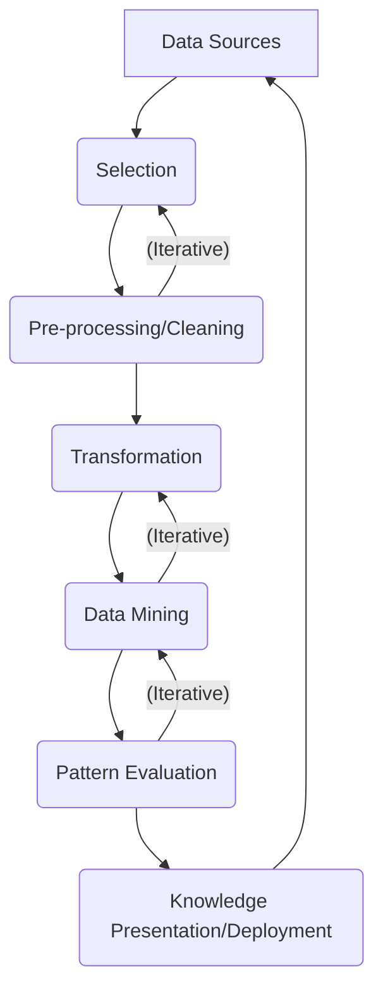

## Data Mart and Data Mining
#### 1. Define Data Marts? Define different types of data marts? When is a data mart appropriate? <br> ->
**Data Marts:** A data mart is a subset of a data warehouse, designed to serve a specific business unit or functional area (e.g., sales, marketing, finance). It focuses on a particular subject, providing targeted data for analysis, making it easier for specific departments to access relevant information without navigating a massive enterprise data warehouse.

Types of Data Marts:

- **Dependent Data Mart:** Created from an existing enterprise data warehouse (EDW). It leverages the EDW's data integrity and consistent structure. Data flows from _operational systems → EDW → Dependent Data Mart_.
- **Independent Data Mart:** Created as a standalone system, without relying on an existing EDW. Data flows directly from _operational systems → Independent Data Mart_.
- **Hybrid Data Mart:** Combines data from an EDW and other operational source systems.

A data mart is appropriate when:

- A specific department requires rapid access to a subset of enterprise data for focused analysis.
- There's a need to improve the performance of queries for a particular business area.
- Security or access control for specific data subsets is crucial.
- The cost and complexity of implementing a full EDW are prohibitive or unnecessary for immediate needs.
- Faster development and deployment are required for specific analytical requirements.

#### 2. Define Data mining? What is the advantages of data mining over traditional approaches? What is an Association rule? What is importance of association rule in data mining? (Support, confidence, item & frequent set) <br> ->

- **Data Mining:** Data mining is the process of discovering patterns, insights, and knowledge from large datasets using computational techniques drawn from machine learning, statistics, and database systems. It aims to extract previously unknown, actionable information.

Advantages of Data Mining over Traditional Approaches:

- **Discovery of Hidden Patterns:** Traditional approaches often require pre-defined hypotheses. Data mining can uncover non-obvious, hidden patterns and relationships.
- **Predictive Power:** Data mining models can predict future trends and behaviors (e.g., customer churn, sales forecasting).
- **Automation:** Automates the process of finding insights in massive datasets, which would be impossible manually.
- **Actionable Insights:** Provides insights that can directly lead to improved decision-making and strategic actions (e.g., targeted marketing).
- **Handling Large Volumes:** Designed to work with very large and complex datasets, where traditional statistical methods might struggle.

**Association Rule:** An association rule is a data mining technique used to find relationships between items in a dataset. It's often expressed as "If A occurs, then B is likely to occur." For example, "Customers who buy bread and butter also tend to buy milk."

Association rules are crucial for:

- **Market Basket Analysis:** Identifying cross-selling opportunities in retail (e.g., product placement).
- **Recommendation Systems:** Suggesting products or content to users.
- **Web Usage Mining:** Understanding user navigation patterns.
- **Fraud Detection:** Identifying unusual co-occurrences of activities.
- **Medical Diagnosis:** Finding correlations between symptoms and diseases.

Key Terms:

- **Item:** A single entity in the dataset (e.g., "bread," "milk," "Diaper").
- **Itemset:** A collection of one or more items (e.g., {"bread", "milk"}).
- **Frequent Itemset:** An itemset that appears frequently enough in the dataset, exceeding a predefined minimum `support` threshold.
- **Support:** A measure of how frequently an itemset appears in the dataset. It's the proportion of transactions that contain the itemset.
  _Support(A → B) = P(A ∪ B) = (Number of transactions containing A and B)/(Total number of transactions)_
- **Confidence:** A measure of how often items in B appear in transactions that also contain items in A. It indicates the reliability of the rule.
  _Confidence(A → B) = P(B|A) = (P(A ∪ B))/(P(A)) = (Number of transactions containing A and B)/(Number of transactions containing A)_

#### 3. What are the applications of data mining? What are the different steps of data mining task? State the difference between data mart & warehouse? What is data warehousing? How is data warehouse different from a database? Does a data warehouse involve a transaction? Explain. Describe characteristics of data warehouse? What do you mean by warehousing schema? Write down the design steps for a typical data warehouse? What are the issues & challenges in data mining? <br> ->

Applications of Data Mining:

- **Retail/Marketing:** Market basket analysis, customer segmentation, churn prediction, targeted promotions.
- **Finance:** Fraud detection, risk assessment, credit scoring, stock market prediction.
- **Healthcare:** Disease diagnosis, drug discovery, patient outcome prediction, personalized medicine.
- **Manufacturing:** Quality control, predictive maintenance, process optimization.
- **Telecommunications:** Call detail record analysis, customer retention, network optimization.
- **Education:** Student performance prediction, course recommendation.
- **Web Mining:** Personalization, search engine optimization, sentiment analysis.
- **Cybersecurity:** Intrusion detection, anomaly detection.

Different Steps of Data Mining Task (often part of **KDD process**):

1.  **Data Cleaning:** Removing noise, handling missing values, resolving inconsistencies.
2.  **Data Integration:** Combining data from multiple diverse sources.
3.  **Data Selection:** Retrieving data relevant to the analysis task.
4.  **Data Transformation:** Normalization, aggregation, feature construction.
5.  **Data Mining:** Applying intelligent methods to extract patterns (e.g., classification, clustering, association rule mining).
6.  **Pattern Evaluation:** Identifying truly interesting patterns based on some metrics.
7.  **Knowledge Presentation:** Visualizing and presenting the discovered knowledge to the user.

**Data Mart Vs Data Warehouse**
| Feature | Data Mart | Data Warehouse |
| :----------- | :------------------------------------------------- | :--------------------------------------------------- |
| **Scope** | Departmental, subject-oriented, specific business unit. | Enterprise-wide, comprehensive, multiple subject areas. |
| **Size** | Smaller in size. | Larger in size. |
| **Data Sources** | Fewer, often from a subset of operational data or EDW. | Many, integrates data from all operational systems. |
| **Design** | Simpler, typically bottom-up or subset of EDW. | Complex, typically top-down or comprehensive integration. |
| **Focus** | Specific analytical needs of a department. | Holistic view for enterprise-wide decision making. |
| **Development** | Faster development and deployment. | Longer development and deployment time. |

**Data Warehousing:** Data warehousing is the process of collecting, storing, and managing integrated data from various disparate sources to support business intelligence (BI), analytics, and decision-making. It involves extracting, transforming, and loading (ETL) data into a central, organized repository.

**Data warehouse Vs database**
| Feature | Data Warehouse | Database (Operational Database/OLTP) |
| :--------------- | :--------------------------------------------------- | :--------------------------------------------------- |
| **Purpose** | Analytics, reporting, decision support (OLAP). | Day-to-day operations, transaction processing (OLTP). |
| **Data Content** | Integrated, historical, summarized, subject-oriented. | Current, detailed, volatile, application-oriented. |
| **Data Schema** | Star, Snowflake schema (denormalized). | ER (Entity-Relationship) models (normalized). |
| **Data Updates** | Infrequent batch updates (ETL). | Frequent, real-time read/write transactions. |
| **Queries** | Complex, analytical queries for large data sets. | Simple, short, transactional queries. |
| **Performance** | Optimized for read-intensive analytical queries. | Optimized for write-intensive transactions. |
| **Redundancy** | Deliberate redundancy for faster queries. | Minimized redundancy to ensure data integrity. |

No, a data warehouse typically does _not_ involve real-time, ACID (Atomicity, Consistency, Isolation, Durability) compliant transactions in the way an operational database does. Data warehouses are designed for analytical processing (OLAP - Online Analytical Processing), not transactional processing (OLTP - Online Transaction Processing).

- **Operational databases (OLTP)** record individual business transactions (e.g., a customer placing an order, a bank withdrawal). They need to ensure atomicity, consistency, isolation, and durability for each small, frequent update.
- **Data warehouses** are loaded with data through an ETL (Extract, Transform, Load) process, which usually happens in batches (e.g., nightly, weekly). While the ETL process itself is a "transaction" in a broader sense (a unit of work), it's not the individual, concurrent, real-time transactions that OLTP systems handle. Once data is loaded into the warehouse, it becomes relatively stable and is primarily read for analysis.

Characteristics of data warehouse:

1.  **Subject-Oriented:** Organized around major subjects (e.g., customer, product, sales) rather than specific applications.
2.  **Integrated:** Data is collected from disparate sources, cleaned, transformed, and integrated into a consistent format, resolving inconsistencies.
3.  **Time-Variant:** Data is stored with a time dimension, allowing for historical analysis. Changes in operational data are captured over time.
4.  **Non-Volatile:** Data, once entered into the data warehouse, is generally not updated or deleted. It's primarily read-only, ensuring historical accuracy.

Warehousing schema refers to the logical design of a data warehouse, which defines how the data is organized, stored, and related to facilitate analytical querying. Unlike highly normalized schemas in transactional databases, data warehouse schemas are typically denormalized to optimize read performance for analytical queries. The most common schemas are:

- **Star Schema:** A central fact table surrounded by multiple dimension tables. The fact table contains factual measures (e.g., sales amount) and foreign keys to the dimension tables. Dimension tables provide descriptive context (e.g., product name, customer demographics). It's simple and efficient for many queries.
- **Snowflake Schema:** An extension of the star schema where dimension tables are further normalized into multiple related tables. This reduces data redundancy but increases join complexity for queries.

Design steps for a typical data warehouse:

1.  **Requirement Gathering & Analysis:** Understand business needs, analytical requirements, and define scope.
2.  **Source System Analysis:** Identify relevant operational data sources, understand their structure, data types, and quality.
3.  **Data Modeling (Dimensional Modeling):** Design the logical structure of the data warehouse, typically using star or snowflake schemas. Identify fact tables and dimension tables.
4.  **ETL (Extract, Transform, Load) Design:** <br> Design the processes to:
    - **Extract:** Pull data from source systems.
    - **Transform:** Clean, standardize, integrate, aggregate, and enrich the data.
    - **Load:** Populate the data into the data warehouse.
5.  **Physical Design:** Choose database technology, indexing strategies, partitioning, and hardware.
6.  **Data Mart Design (Optional):** Design specific data marts if required.
7.  **BI Tool Integration & Reporting:** Configure reporting tools and dashboards for end-users.
8.  **Deployment & Testing:** Implement the solution, populate with initial data, and thoroughly test for data accuracy, performance, and usability.
9.  **Maintenance & Growth:** Ongoing monitoring, performance tuning, adding new data sources, and evolving with business needs.

Issues & challenges in data mining:

1.  **Data Quality:** Noisy, incomplete, or inconsistent data can lead to inaccurate patterns.
2.  **Data Heterogeneity:** Integrating diverse data from multiple sources with different formats and semantics.
3.  **Scalability:** Mining algorithms must be scalable to handle massive datasets (big data).
4.  **Dimensionality Curse:** Dealing with high-dimensional data, which can degrade algorithm performance and make patterns harder to find.
5.  **Interpretability of Patterns:** Discovered patterns might be complex and difficult for human experts to understand or act upon.
6.  **Privacy and Security:** Protecting sensitive information during mining and ensuring compliance with regulations (e.g., GDPR, HIPAA).
7.  **Overfitting:** Models might fit the training data too closely, performing poorly on new, unseen data.
8.  **Interestingness of Patterns:** Many discovered patterns might be trivial or uninteresting, requiring metrics to filter out valuable ones.
9.  **Changing Data:** Patterns can evolve over time, requiring models to be regularly updated and retrained.
10. **Ethical Considerations:** Bias in data can lead to unfair or discriminatory outcomes from mining models.

#### 4. What is sequence mining? What is text mining? What is strategic information? <br> ->

- **Sequence Mining:** Sequence mining (or sequential pattern mining) is a data mining technique used to find statistically relevant patterns between data items that appear in a specific order. It aims to discover frequently occurring ordered events or subsequences within a larger sequence. - **Example:** Analyzing website clickstreams to find common navigation paths (e.g., `Home Page -> Product Page -> Add to Cart -> Checkout`). Other applications include DNA sequences, alarm sequences in telecommunications, and customer purchase histories over time.

**Text Mining:** Text mining (or text data mining) is the process of deriving high-quality information from text. It involves techniques from natural language processing (NLP), machine learning, and statistics to transform unstructured text data into structured, actionable insights.

- **Applications:** Sentiment analysis (customer reviews), topic modeling, spam filtering, document classification, information extraction (e.g., named entity recognition).

**Strategic Information:** Strategic information refers to the data and insights that assist senior management in making long-term, high-level decisions for the organization. It's often external-facing (e.g., market trends, competitor analysis, economic forecasts) and highly aggregated, focusing on future directions and competitive advantage. It's crucial for setting goals, formulating policies, and allocating resources effectively.

#### 5. What are the issues relating to the diversity of database types? What are the steps involved in knowledge discovery in database (KDD) process? Explain the flowchart for KDD process? Define roll-up & drill-down process with suitable example? What is K-means clustering? What is its significance? <br> ->

- **Issues relating to the diversity of database types:**
  The diversity of database types (e.g., relational databases, NoSQL databases, data lakes, flat files, spreadsheets) presents significant challenges for data integration and data mining:

1.  **Structural Heterogeneity:** Different schemas, data models (relational, document, graph), and storage formats.
2.  **Syntactic Heterogeneity:** Different data types for the same concept (e.g., 'date' stored as `YYYY-MM-DD` in one system and `MM/DD/YYYY` in another).
3.  **Semantic Heterogeneity:** Same data represented with different meanings or contexts (e.g., 'customer' might mean an individual in sales and a company in finance).
4.  **Data Quality Variations:** Different levels of cleanliness, accuracy, and completeness across sources.
5.  **Scalability and Performance:** Efficiently extracting and processing data from vastly different systems with varying performance characteristics.
6.  **Security and Access Control:** Managing permissions and security policies across diverse database technologies.
7.  **Data Volume and Velocity:** Handling the sheer volume and rapid arrival of data from various sources.
8.  **Tooling Complexity:** Requires a wide array of tools and expertise to handle data integration, transformation, and management across different types.

The **Knowledge Discovery in Databases (KDD)** process is a multi-step iterative process for extracting valid, novel, potentially useful, and ultimately understandable patterns from data. Data mining is a core step within KDD.
**Steps of KDD Process:**

1.  **Selection:** Choosing the target data (relevant data from databases/data warehouses) for the KDD process.
2.  **Pre-processing (Data Cleaning):** Handling noisy data, missing values, and inconsistencies; removing irrelevant data.
3.  **Transformation:** Consolidating and transforming data into a form suitable for mining (e.g., normalization, aggregation, feature construction).
4.  **Data Mining:** Applying intelligent methods (algorithms) to extract patterns from the transformed data (e.g., classification, clustering, association rule mining).
5.  **Evaluation:** Interpreting and evaluating the discovered patterns, filtering out uninteresting ones, and identifying truly valuable knowledge.
6.  **Deployment (Knowledge Presentation):** Incorporating the discovered knowledge into a system for decision-making or presenting it to stakeholders.

**Flowchart for KDD Process (Conceptual):**



- **Data Sources:** Raw data repositories.
- **Selection:** Identifying the data subset.
- **Pre-processing/Cleaning:** Improving data quality.
- **Transformation:** Preparing data for algorithms.
- **Data Mining:** Applying algorithms to find patterns.
- **Pattern Evaluation:** Assessing the patterns.
- **Knowledge Presentation/Deployment:** Using the insights.
- The arrows indicate flow, and the iterative loops signify that steps can be revisited based on outcomes.

These are OLAP (Online Analytical Processing) operations used to explore data in a data warehouse.

- **Roll-up (Aggregation):** Summarizing data by moving up the hierarchy or by reducing the number of dimensions. It reduces the detail level.

  - **Example:** Imagine a sales data cube with dimensions: `Time (Day, Month, Quarter, Year)`, `Product (SKU, Category)`, `Location (City, State, Country)`.
    - You initially view sales by `City` and `Product Category`.
    - A **roll-up** operation on `Location` from `City` to `State` would aggregate sales data, showing total sales for each `State` across all `Product Categories`.
    - Alternatively, rolling up by removing the `Product Category` dimension would show total sales by `State` for all products.

- **Drill-down (Detailing):** Navigating from summarized data to more detailed data or by adding new dimensions. It increases the detail level.

  - **Example:** Using the same sales data.
    - You are currently viewing sales by `Quarter` and `Product Category`.
    - A **drill-down** operation on `Time` from `Quarter` to `Month` would break down the quarterly sales into monthly sales for each `Product Category`.
    - Alternatively, drilling down by adding the `Customer Segment` dimension would show sales broken down by `Quarter`, `Product Category`, and `Customer Segment`.

- **K-means Clustering:** K-means is an unsupervised machine learning algorithm used for partitioning a dataset into _K_ distinct, non-overlapping subgroups (clusters). The goal is to group data points such that those in the same cluster are as similar as possible, while points in different clusters are as dissimilar as possible. Similarity is typically measured by Euclidean distance.

  - **Algorithm Steps:**
    1.  **Initialization:** Randomly select _K_ data points as initial centroids (cluster centers).
    2.  **Assignment Step:** Assign each data point to the cluster whose centroid is closest.
    3.  **Update Step:** Recalculate the centroids for each cluster based on the mean of all data points assigned to that cluster.
    4.  **Iteration:** Repeat assignment and update steps until the centroids no longer move significantly or a maximum number of iterations is reached.

- **Significance:**
  1.  **Customer Segmentation:** Identifying distinct groups of customers for targeted marketing.
  2.  **Document Clustering:** Grouping similar news articles, research papers, or web pages.
  3.  **Image Segmentation:** Dividing an image into regions based on color or texture.
  4.  **Anomaly Detection:** Outliers that don't fit well into any cluster can be flagged as anomalies.
  5.  **Scientific Research:** Identifying patterns in biological data, astronomical data, etc.
  6.  **Simplicity and Efficiency:** Relatively simple to understand and computationally efficient for large datasets, making it widely used.

#### 6. What are the different tiers in a typical 3-tier data warehousing architecture? Write difference between DBMS & Data mining? <br> ->

Bottom Tier (**Data Warehouse Server**):

- This is the foundational layer, typically an RDBMS server (or a specialized data warehouse appliance/cloud service).
- It stores the actual data warehouse and often includes the **ETL (Extract, Transform, Load)** tools.
- Data is sourced from operational databases, external files, etc., cleaned, transformed, and loaded here.
- It handles data storage, management, and basic query processing.

Middle Tier (**OLAP Server**):

- This layer sits between the data warehouse database and the front-end tools.
- It is an **OLAP (Online Analytical Processing) server**, which can be:
  - **ROLAP (Relational OLAP):** Uses an extended relational DBMS to store and manage warehouse data, and an intermediate mapping layer to process OLAP queries.
  - **MOLAP (Multidimensional OLAP):** Stores data in a specialized multidimensional database (cube) structure for fast query performance.
  - **HOLAP (Hybrid OLAP):** Combines features of ROLAP and MOLAP.
- Its primary function is to provide rapid and flexible analysis of large datasets by pre-aggregating data or providing specialized indexing structures for OLAP operations (slice, dice, drill-down, roll-up, pivot).

Top Tier (**Front-End Client Layer**):

- This is the presentation layer where end-users interact with the data warehouse.
- It includes various **client tools** for querying, reporting, analysis, and data mining.
- Examples: Query and reporting tools, OLAP tools (for interactive analysis), data mining tools, web browsers for dashboards.

**DBMS Vs Data mining**
| Feature | DBMS (Database Management System) | Data Mining |
| :--------------- | :-------------------------------------------------------------------------------------------------------- | :------------------------------------------------------------------------------------------- |
| **Primary Goal** | Efficient storage, retrieval, and management of data. | Discovering hidden patterns, insights, and knowledge from data. |
| **Function** | Data organization, transactional processing, query execution (SQL). | Pattern discovery, prediction, descriptive analysis. |
| **Focus** | What data is stored and how to access specific data. | What insights can be extracted from the data. |
| **Input** | Raw data, structured information. | Processed, integrated, and sometimes transformed data (often from a DBMS or data warehouse). |
| **Output** | Specific data records, tables, query results. | Models (e.g., classification, clustering), rules (e.g., association rules), predictions. |
| **Methodology** | CRUD operations (Create, Read, Update, Delete), SQL queries. | Statistical algorithms, machine learning techniques, AI. |
| **Users** | Application programs, database administrators, general users. | Data scientists, analysts, business intelligence professionals. |
| **Relationship** | Data mining often uses data _stored in_ a DBMS or data warehouse. DBMS is a prerequisite for data mining. | Data mining leverages DBMS/DW for its input. |

#### 7. Explain scalable methods for mining sequential patterns? Evaluate the challenges associated with data integration in Data warehousing? {Numerical on K-means clustering} <br> ->

Mining sequential patterns from large datasets is computationally intensive. Scalable methods are crucial to handle the vast volume of data, especially for long sequences and diverse itemsets.

1.  **Generalized Sequential Pattern (GSP) Algorithm:** An extension of the Apriori algorithm for sequential patterns. It iteratively finds frequent subsequences by generating candidate subsequences of length `k` from frequent subsequences of length `k-1`, then pruning infrequent candidates. It uses a database scan in each iteration.
2.  **PrefixSpan (Prefix-projected Sequential Pattern mining):** An efficient, pattern-growth approach. Instead of candidate generation and testing, it uses a divide-and-conquer strategy. It recursively projects the database based on prefixes and mines patterns from these projected databases. It avoids expensive candidate generation and pruning, often performing better than Apriori-like methods for long patterns.
3.  **SPADE (Sequential Pattern Discovery using Equivalence classes):** Uses a lattice-based approach and performs multiple database scans (like GSP) but is optimized by transforming the database into vertical ID-list format, which allows efficient support counting using join operations.
4.  **Distributed/Parallel Algorithms:** For extremely large datasets, techniques that distribute the data and computation across multiple machines (e.g., using MapReduce or Spark frameworks) are employed. This includes parallel versions of GSP, PrefixSpan, etc., or techniques that partition the dataset and combine results.
5.  **Approximate Algorithms/Sampling:** For very large datasets where exact results are not strictly necessary, sampling a subset of the data or using approximation algorithms can significantly improve scalability at the cost of some precision.

Data integration is the process of combining data from various disparate sources into a unified view in the data warehouse. It's often the most complex and time-consuming part of data warehousing (consuming 60-80% of project effort).

1.  **Schema Heterogeneity:** Different source systems use different schemas (e.g., relational, XML, flat file) and data models. Mapping these diverse schemas into a single, consistent warehouse schema is complex.
2.  **Semantic Heterogeneity:** The same data element can have different meanings or interpretations across different sources (e.g., "customer" in sales vs. "client" in finance). This requires deep domain knowledge and careful reconciliation.
3.  **Data Inconsistency and Duplication:** Different sources might contain conflicting data for the same entity (e.g., different addresses for the same customer). Identifying and resolving duplicates and inconsistencies is critical.
4.  **Data Quality Issues:** Source data often suffers from noise, missing values, incorrect formats, and outdated information. Extensive data cleaning and transformation are required to ensure data quality in the warehouse.
5.  **Data Volume and Velocity:** Integrating data from numerous sources, especially in real-time or near-real-time scenarios, can overwhelm existing infrastructure and processing capabilities.
6.  **Lack of Common Identifiers:** Different systems might use different keys or identifiers for the same entity (e.g., customer IDs). Establishing master data management (MDM) or creating surrogate keys is often necessary.
7.  **Data Transformation Complexity:** Transforming data from source formats to the warehouse's target format (e.g., converting data types, aggregating data, deriving new attributes) involves complex ETL logic.
8.  **Technical Debt:** Integrating legacy systems with modern ones poses challenges due to outdated technologies, undocumented schemas, and lack of APIs.
9.  **Security and Compliance:** Ensuring that data integration processes adhere to privacy regulations (e.g., GDPR, HIPAA) and security policies, especially when dealing with sensitive information from various sources.
10. **Performance of ETL:** The ETL process itself must be optimized to extract, transform, and load large volumes of data efficiently within defined time windows.

**Numerical on K-means clustering:**

>**NOTE:** <br>
> This is a theoretical request, so I'll describe the _steps_ to solve a numerical problem, as actually doing it would be too long for this format.

**Problem Example:** Given a set of 2D data points and _K=2_, perform one iteration of K-means clustering.
Data points: `P1(2,10), P2(2,5), P3(8,4), P4(5,8), P5(7,5), P6(6,4), P7(1,2), P8(4,9)`
Initial centroids: `C1(2,10), C2(5,8)` (typically random or based on some heuristic)

**Steps to Solve:**

1.  **Assignment Step:** For each data point, calculate its Euclidean distance to _each_ centroid and assign the point to the cluster of the _closest_ centroid.

- For P1(2,10):
  - Distance to C1(2,10): _√((2-2)^2 + (10-10)^2) = 0_
  - Distance to C2(5,8): _√((2-5)^2 + (10-8)^2) = √(9+4) = √(13) ≈ 3.61_
  - Assign P1 to Cluster 1.
- Repeat for P2, P3, P4, P5, P6, P7, P8.
- _Example Calculation for P2(2,5):_
  - Dist to C1(2,10): _√((2-2)^2 + (5-10)^2) = √(0+25) = 5_
  - Dist to C2(5,8): _√((2-5)^2 + (5-8)^2) = √(9+9) = √(18) ≈ 4.24_
  - Assign P2 to Cluster 2.
- ... (continue for all points)

2.  **Update Step:** After assigning all points, recalculate the new centroids for each cluster by taking the mean (average) of all points assigned to that cluster.

- **New C1 (mean of all points assigned to C1 in Assignment Step):**
  - If P1, P4, P8 were assigned to C1:
    - New X-coord: _(2+5+4)/3 = 11/3 ≈ 3.67_
    - New Y-coord: _(10+8+9)/3 = 27/3 = 9_
    - New C1: _(3.67, 9)_
- **New C2 (mean of all points assigned to C2 in Assignment Step):**
  - If P2, P3, P5, P6, P7 were assigned to C2:
    - New X-coord: _(2+8+7+6+1)/5 = 24/5 = 4.8_
    - New Y-coord: _(5+4+5+4+2)/5 = 20/5 = 4_
    - New C2: _(4.8, 4)_

This completes one iteration. The process would then repeat with the new centroids until convergence.

#### 8. How data mining techniques can be applied in retail to improve sales & customer satisfaction? Explain the significance of scalable methods in data mining & give example of scalable algorithm? Discuss the concept of correlation analysis in data mining & its applications? <br> ->

1.  **Market Basket Analysis (Association Rules):** - **Sales:** Identify products frequently purchased together (e.g., bread and butter). This informs product placement, cross-selling strategies, and bundle deals. - **Satisfaction:** Improve customer experience by suggesting complementary products.
2.  **Customer Segmentation (Clustering):** - **Sales:** Group customers into segments based on purchasing behavior, demographics, or preferences. This enables highly targeted marketing campaigns, personalized recommendations, and custom promotions for high-value segments. - **Satisfaction:** Tailor communication, product offerings, and loyalty programs to specific customer groups, increasing relevance and satisfaction.
3.  **Churn Prediction (Classification):** - **Sales:** Identify customers at risk of leaving. Proactive retention strategies (special offers, personalized outreach) can prevent revenue loss. - **Satisfaction:** Address potential issues before they lead to customer dissatisfaction and defection.
4.  **Sales Forecasting (Time Series Analysis/Regression):** - **Sales:** Predict future sales trends for products or categories. This optimizes inventory management, reduces stockouts or overstocking, and improves supply chain efficiency. - **Satisfaction:** Ensure product availability to meet customer demand.
5.  **Personalized Recommendations (Collaborative Filtering/Association Rules):** - **Sales:** Recommend products based on past purchases or Browse history, driving additional sales (e.g., "customers who bought this also bought..."). - **Satisfaction:** Enhance the shopping experience by showing relevant products, saving customers time and effort.
6.  **Fraud Detection (Anomaly Detection):** - **Sales:** Identify fraudulent transactions (e.g., credit card fraud, coupon abuse), minimizing financial losses. - **Satisfaction:** Protect legitimate customers from fraudulent activities impacting their accounts.
7.  **Location-Based Services:** - **Sales:** Analyze foot traffic patterns in stores, optimize store layouts, and send targeted promotions to customers in specific areas. - **Satisfaction:** Improve in-store navigation and offer relevant real-time deals.

**Significance of Scalable Methods:**
The exponential growth of data (Big Data) makes scalable methods indispensable in data mining.

1.  **Handling Big Data:** Traditional data mining algorithms often fail or become extremely slow when applied to datasets that are terabytes or petabytes in size. Scalable methods are designed to process and learn from these massive datasets efficiently.
2.  **Timeliness of Insights:** In many business scenarios, insights need to be delivered quickly (e.g., real-time fraud detection, personalized recommendations). Scalable methods enable faster processing, leading to more timely and actionable knowledge.
3.  **Resource Efficiency:** By optimizing algorithms to use memory and CPU more efficiently, scalable methods allow for analysis on available hardware resources, potentially reducing infrastructure costs.
4.  **Maintaining Accuracy:** As data volume increases, sampling might lead to loss of information or introduce bias. Scalable methods can often process the entire dataset, leading to more accurate and robust patterns.
5.  **Addressing Data Velocity:** For streaming data, scalable algorithms (often incremental or online) can process data as it arrives, providing continuous insights.

**Example of Scalable Algorithm:**

- **Distributed K-means (e.g., via MapReduce/Spark):** The standard K-means algorithm can be parallelized.
  - **Map Phase:** Each data point is assigned to its closest centroid in parallel across multiple nodes.
  - **Reduce Phase:** For each cluster, the sum of points and count of points are aggregated across nodes, and then a new centroid is calculated.
    This allows K-means to operate on datasets that are too large to fit into the memory of a single machine.
- **FP-growth (for Association Rules):** A tree-based algorithm that avoids the costly candidate generation step of Apriori. It compresses the database into a Frequent-Pattern tree (FP-tree) and then mines frequent itemsets directly from this tree, making it more scalable for dense and large datasets.

**Correlation Analysis:**
Correlation analysis in data mining is a statistical technique used to determine the strength and direction of a linear relationship between two or more quantitative variables. It helps in understanding how variables move together.

- **Correlation Coefficient (e.g., Pearson's r):** Typically ranges from -1 to +1.
  - **+1:** Perfect positive linear relationship (as one variable increases, the other increases proportionally).
  - **-1:** Perfect negative linear relationship (as one variable increases, the other decreases proportionally).
  - **0:** No linear relationship.
- **Causation vs. Correlation:** It's crucial to remember that correlation does _not_ imply causation. Just because two variables move together doesn't mean one causes the other; there might be a third confounding variable or it could be coincidental.

**Applications of Correlation Analysis in Data Mining:**

1.  **Feature Selection/Reduction:** Identifying highly correlated features can help in reducing dimensionality for machine learning models. If two features are highly correlated, one might be redundant.
2.  **Understanding Relationships:** Discovering which variables tend to vary together. For example, in retail, finding a strong positive correlation between "advertisement spending" and "sales revenue."
3.  **Market Basket Analysis (as a precursor or complement to Association Rules):** While association rules find patterns like "if A then B," correlation can quantify how strongly the presence of one item affects the presence of another, beyond just frequency.
4.  **Risk Management:** In finance, identifying correlations between different assets or market indicators to understand portfolio risk.
5.  **Quality Control:** In manufacturing, correlating process parameters with product defects to identify root causes.
6.  **Predictive Modeling:** Understanding correlations helps in building better predictive models by identifying independent variables that significantly influence the dependent variable.
7.  **Data Cleaning:** Identifying unexpected correlations (or lack thereof) can sometimes point to data quality issues.
8.  **Customer Behavior Analysis:** Correlating customer demographics with purchasing behavior (e.g., age group correlating with preference for certain product types).

<div style="page-break-before: always;"></div>

## Classification & prediction of data warehousing
#### 1. Explain the use of dynamic itemset counting algorithm? <br> ->
The **Dynamic Itemset Counting (DIC)** algorithm is an improvement over the **Apriori** algorithm for mining frequent itemsets. Its primary use is to reduce the number of database scans required, thereby improving efficiency, especially for large datasets.

Working of **DIC**:
- Unlike **Apriori**, which requires a full scan of the database for each pass (to generate candidate itemsets of length k from frequent itemsets of length k-1), DIC performs multiple passes over portions of the database and dynamically updates candidate itemsets.
- It divides the database into blocks (or partitions). It scans one block at a time.
- While scanning, it maintains counts for existing candidate itemsets.
- Crucially, it also introduces _new_ candidate itemsets (e.g., from frequent 1-itemsets to 2-itemsets) _mid-scan_, rather than waiting for the entire database scan to complete.
- It uses a flagging mechanism to track which itemsets are "solid" (proven frequent), "dotted" (candidates being counted), or "new" (newly generated candidates).
- This dynamic addition of candidates allows it to discover frequent itemsets of different lengths within the same pass over a block, potentially reducing the total number of passes over the entire database.

**Use Case:** <br> It's particularly useful when the database is too large to fit in memory and multiple full scans are very expensive, making the discovery of frequent itemsets more efficient.

#### 2. Describe the principle of partitioning technique for frequent itemset generation & justify how it improves the efficiency of frequent itemset generation compared to Apriori algorithm? State Apriori algorithm for frequent item set generation? <br> ->
The **partitioning algorithm** for frequent itemset generation aims to improve the efficiency of frequent itemset mining by reducing the number of database scans and making the process parallelizable. Its core principle is based on the observation that if an itemset is frequent in the entire database, it must be frequent in at least one partition of the database.
1.  **Divide Database:** The database is divided into a set of non-overlapping partitions. Each partition must be small enough to fit into main memory.
2.  **Local Frequent Itemsets:** For each partition, the **Apriori** algorithm (or any other frequent itemset mining algorithm) is run independently to find all *local* frequent itemsets (itemsets that meet the support threshold *within that partition*).
3.  **Candidate Generation:** All unique local frequent itemsets from all partitions are combined to form a global set of *potential* frequent itemsets for the entire database. This is a crucial step: any globally frequent itemset *must* be in this combined set.
4.  **Global Count:** A final single pass over the entire database is performed to count the global support for each itemset in the combined set of potential frequent itemsets.
5.  **Final Frequent Itemsets:** Those potential frequent itemsets that meet the global support threshold are declared as globally frequent.

Justification of Improved Efficiency over **Apriori**:
1.  **Reduced Database Scans:** Apriori requires `k` (length of longest frequent itemset) passes over the entire database. Partitioning reduces this to **two passes** over the entire database: one initial pass to generate local frequent itemsets for each partition (effectively $N$ mini-scans where $N$ is number of partitions, often parallelizable), and one final pass to count global support.
2.  **Memory Management:** Each partition is processed in main memory, avoiding repeated disk I/O, which is a major bottleneck for **Apriori** on large datasets.
3.  **Parallelization:** The process of finding local frequent itemsets in each partition can be performed in parallel on different processors or machines, significantly speeding up computation.
4.  **Early Pruning:** Itemsets that are not locally frequent in *any* partition are immediately pruned, never becoming global candidates, reducing the search space.

Apriori Algorithm for Frequent Itemset Generation:
The **Apriori** algorithm is a classic algorithm for mining frequent itemsets (patterns of items that occur together frequently) from transactional databases. It relies on the "**Apriori** property": **All non-empty subsets of a frequent itemset must also be frequent.**

**Steps:**
1.  **Initialization (C1, L1):**
	* **C1 (Candidate 1-itemsets):** Scan the database once to count the occurrences of each individual item (1-itemset).
	* **L1 (Frequent 1-itemsets):** From C1, identify all 1-itemsets whose support count is greater than or equal to the minimum support threshold.
2.  **Iterative Candidate Generation (Ck) and Pruning (Lk):**
	* **Loop:** For $k = 2, 3, …$ until no more frequent itemsets are found:
		* **Generate Ck (Candidate k-itemsets):** Use the frequent itemsets from the previous pass (L$_{k-1}$) to generate candidate k-itemsets. This is done by joining L$_{k-1}$ with itself (e.g., if {A,B} and {A,C} are in L2, candidate {A,B,C} is generated).
		* **Prune Ck:** Apply the Apriori property: If any $(k-1)$-subset of a candidate k-itemset is *not* in L$_{k-1}$, then this candidate k-itemset cannot be frequent, so it is removed from Ck.
		* **Count Support (Scan Database):** Scan the database to count the support of each candidate in Ck.
		* **Generate Lk (Frequent k-itemsets):** From Ck, select all candidate k-itemsets whose support count meets the minimum support threshold.
3.  **Termination:** The algorithm stops when no new frequent itemsets are generated (i.e., Lk is empty).

#### 3. What is clustering? Discuss two main methods of clustering? Why it is difficult to handle categorical data for clustering? Distinguish between partition clustering & hierarchical clustering? What are the features of good clustering? Why it is required for data warehousing & data mining? <br> ->
**Clustering** is an unsupervised machine learning technique used to group a set of data objects into subsets (clusters) such that objects within the same cluster are more similar to each other than to those in other clusters. The goal is to discover inherent groupings or structures within the data without any prior knowledge of class labels.

Two main methods of clustering are:
1. **Partitioning Methods:** These methods divide data objects into a specified number of non-overlapping clusters ($k$). The goal is to minimize the sum of squared distances between data points and their cluster centroids/medoids. The number of clusters ($k$) must be pre-specified.
	- **Examples:** K-means, K-medoids (PAM, CLARA, CLARANS).
	- **Characteristics:** Relatively efficient for large datasets, but sensitive to initial partitions and outliers.
2. **Hierarchical Methods:** These methods build a hierarchy of clusters. They create a tree-like structure (dendrogram) representing nested clusters. They can be:
	* **Agglomerative (Bottom-Up):** Starts with each data point as a single cluster and iteratively merges the closest clusters until all points are in one cluster or a stopping criterion is met.
	* **Divisive (Top-Down):** Starts with all data points in one cluster and recursively splits the clusters into smaller ones until each point is in its own cluster or a stopping criterion is met.
	* **Examples:** AGNES, DIANA.
	* **Characteristics:** Provide a detailed view of cluster relationships, but can be computationally expensive for large datasets.

It difficult to handle categorical data for clustering due to the following reasons:
1. **Distance Metrics:** Most standard clustering algorithms (like K-means) rely on distance metrics (e.g., Euclidean distance) that are defined for numerical data. Defining a meaningful "distance" between categorical values is not straightforward. <br> _Example:_ What's the distance between "red" and "blue" vs. "red" and "green"? A simple binary match (0 if same, 1 if different) might not capture semantic closeness. 
2. **Mean Calculation:** Algorithms like K-means calculate centroids by averaging data points. Averaging categorical values (e.g., averaging "Male" and "Female") is not mathematically meaningful.
3. **Order and Scale:** Categorical data lacks inherent order or scale, making it hard to apply algorithms designed for continuous spaces.
4. **High Dimensionality (with one-hot encoding):** Converting categorical variables into numerical ones using one-hot encoding can lead to a very high-dimensional sparse dataset, which can negatively impact clustering performance (curse of dimensionality).

**Partitioning Clustering Vs Hierarchical Clustering**
| Feature             | Partitioning Clustering                       | Hierarchical Clustering                             |
| :------------------ | :-------------------------------------------- | :-------------------------------------------------- |
| **Output** | A set of $k$ distinct, non-overlapping clusters. | A hierarchy (dendrogram) of nested clusters.       |
| **Number of Clusters (K)** | Must be pre-specified by the user.            | Not explicitly pre-specified; determined by cutting the dendrogram. |
| **Cluster Structure** | Flat structure; no inherent nested relationships. | Tree-like, shows relationships between clusters.   |
| **Approach** | Iterative reallocation of data points.        | Agglomerative (bottom-up merging) or Divisive (top-down splitting). |
| **Flexibility** | Less flexible; output is a single partition.  | More flexible; allows exploring different granularity levels. |
| **Computational Cost** | Generally more efficient for large datasets.  | Can be computationally expensive for large datasets. |
| **Sensitivity** | Sensitive to initial centroid placement and outliers. | Sensitive to the choice of linkage criteria.        |

The features of good clustering are:
1. **High Intra-cluster Similarity:** Objects within the same cluster should be highly similar to each other.
2. **Low Inter-cluster Similarity:** Objects in different clusters should be highly dissimilar to each other.
3. **High Quality:** The clustering results should be meaningful, useful, and interpretable for the specific application.
4. **Robustness:** The clustering should be relatively insensitive to the order of input data or small changes in data.
5. **Scalability:** Ability to handle large datasets efficiently.
6. **Ability to discover clusters with arbitrary shapes:** Not restricted to spherical or convex shapes (e.g., density-based methods).
7. **Ability to handle noisy data and outliers:** Not overly sensitive to irrelevant data or extreme values.

Clustering required for data warehousing:
- **Data Summarization/Reduction:** Clustering can pre-process large datasets in the warehouse by grouping similar data, creating summarized views that reduce storage and improve query performance for analytical tools.
- **Data Loading/ETL:** Can help in identifying similar records across disparate sources for integration and de-duplication during the ETL process.
- **Schema Design:** Understanding natural groupings can inform the design of dimension tables or hierarchies.

Clustering required for Data Mining:
- **Customer Segmentation:** Grouping customers for targeted marketing, personalized recommendations, and understanding customer behavior. (e.g., segmenting customers into "high-value," "at-risk," etc.)
- **Anomaly/Outlier Detection:** Data points that do not fit well into any cluster can be identified as anomalies or outliers, useful for fraud detection or fault diagnosis.
- **Trend Analysis:** Identifying clusters of similar trends over time (e.g., stock market trends, disease outbreaks).
- **Text and Image Processing:** Grouping similar documents or images for better organization and retrieval.
- **Hypothesis Generation:** Discovering previously unknown patterns that can lead to new business hypotheses or scientific discoveries. 
- **Data Pre-processing:** Can be used as a preprocessing step to reduce dimensionality or create new features for supervised learning tasks.

#### 4. What is metadata in data warehousing? What is metadata catalog? Explain different types of metadata? <br> ->
**Data Warehousing**
Metadata in data warehousing is "data about data." It provides context and meaning to the data stored in the warehouse. It describes the source, transformations, structure, usage, and quality of the data. It's crucial for understanding, managing, and utilizing the data warehouse effectively.

**Metadata Catalog**
A metadata catalog (or metadata repository) is a central repository where all the metadata related to the data warehouse is stored and managed. It acts as a comprehensive directory for all information about the data. It enables data users, developers, and administrators to understand the data landscape, track data lineage, ensure data quality, and manage the data warehouse lifecycle.

**Operational Metadata Vs Business Metadata Vs Technical Metadata**
| Feature           | Operational Metadata      | Business Metadata         | Technical Metadata           |
| :---------------- | :------------------------ | :------------------------ | :--------------------------- |
| **Description** | Source data specifics     | Business context for data | DW structure, tech details   |
| **Examples** | Source tables, ETL logs   | KPIs, biz terms           | DW tables, ETL code          |
| **Purpose** | Raw data, ETL fix, trace  | Biz understand, decision  | IT use, DW management        |

#### 5. Describe the working of the PAM algorithm? Compare its performance with CLARA & CLARANS? What is PAM clustering technique? Write a short note on CLARANS clustering algorithm vs PAM & CLARA? How is CLARANS different from CLARA? <br> ->
**PAM (Partitioning Around Medoids)** is a partitioning clustering algorithm that groups data points into $K$ clusters. Unlike K-means, which uses the mean (centroid) as the cluster center, PAM uses an actual data point from the cluster, called a **medoid**, as its representative. A medoid is defined as the object in a cluster whose average dissimilarity to all other objects in the cluster is minimal.

The PAM algorithm works in two phases:
1.  **Build Phase:**
	* Initialize $K$ medoids. This can be done randomly or by choosing $K$ data points that are widely separated.
	* Assign each non-medoid data object to its closest medoid.
	* This forms an initial set of $K$ clusters.
2.  **Swap Phase (Iterative Improvement):**
	* For each current medoid $m$, and for each non-medoid object $o$:
			* Hypothetically swap $m$ with $o$.
			* Calculate the total cost of the configuration if the swap were to occur. The "cost" is typically the sum of dissimilarities of all objects to their closest medoid.
			* If the swap results in a reduction in the total cost, perform the swap (i.e., $o$ becomes a medoid, and $m$ becomes a non-medoid object).
	* Repeat the swap phase until no further reduction in total cost can be achieved (i.e., no swap improves the clustering).

**PAM Vs CLARA Vs CLARANS**
| Feature        | PAM (Partitioning Around Medoids)                | CLARA (Clustering LARge Applications)                    | CLARANS (Clustering Large Applications based upon RANdomized Search) |
| :------------- | :----------------------------------------------- | :------------------------------------------------------- | :------------------------------------------------------------------- |
| **Time Comp.** | $O(K(N-K)^2)$ or $O(K \cdot N^2)$ per iteration | $O(K \cdot S^2 + K(N-K))$ (S << N)                     | Roughly $O(N \cdot K^2)$, avg lower                         |
| **Space Comp.**| $O(N^2)$                                         | Less than PAM (operates on samples)                      | Less than PAM (randomized search)                            |
| **Accuracy** | High, directly optimizes dissimilarity           | Depends on sample quality, can miss optimal                | Generally better than CLARA, explores more combinations      |
| **Scalability**| Not for N > 1000                                 | Much better than PAM, uses samples                       | More than PAM/CLARA, still struggles with massive datasets |

**PAM:** The brute-force approach. It explores all possible pairs of current medoids and non-medoids for swaps to find the best configuration. Highly accurate but computationally prohibitive for large datasets.

**CLARA:** Addresses PAM's scalability issue by performing PAM on multiple random *samples* of the dataset. It then selects the best clustering result among these samples. It's a heuristic solution, faster but its quality is sample-dependent.

**CLARANS:** Improves upon CLARA by performing a **randomized local search** on a graph where nodes are sets of K medoids and edges represent adjacent sets (differing by one medoid). Instead of sampling the data, CLARANS samples the *search space* of possible medoids. It starts with a random set of $K$ medoids and iteratively moves to a neighbor (by swapping a medoid with a non-medoid) if it improves the cost, but it *doesn't* exhaustively check all neighbors like PAM. It repeats this process multiple times with different initial medoid sets to find a good solution.

The key difference lies in their approach to scalability and optimization:
* **CLARA (Sample-based):** Samples the *data* and applies PAM to these smaller samples. Its search for optimal medoids is limited to the selected samples.
* **CLARANS (Randomized Search-based):** Samples the *search space* of possible medoid combinations (a graph) and uses a randomized local search. It operates on the full dataset but explores only a subset of potential medoid swaps at each step, making it more robust against poor sampling than CLARA and often leading to higher quality results.

#### 6. What is dimensional modeling? What is generalized association rules? Discuss K-means or K-medoid algorithm & with suitable example? Explain KNN algorithm with suitable example? <br> ->
**Dimensional modeling** is a logical design technique for data warehouses (or data marts) that structures data for analytical querying and reporting. It organizes data into "facts" (quantitative measurements) and "dimensions" (descriptive attributes that provide context to the facts). The most common dimensional models are the Star Schema and Snowflake Schema.
* **Fact Table:** Contains factual measures (metrics) that represent business events (e.g., sales amount, quantity sold) and foreign keys to dimension tables. Fact tables are typically large.
* **Dimension Tables:** Contain descriptive attributes that provide context to the facts. They are typically smaller and contain hierarchical information (e.g., product name, category, brand; customer name, address, segment; time day, month, year).
* **Goal:** To optimize for read-intensive queries, ease of understanding for business users, and faster query performance compared to highly normalized transactional databases.

**Generalized association rules** are an extension of traditional association rules that allow for the discovery of relationships between items at **different levels of abstraction (granularity)** in a concept hierarchy.
* **Example:** Instead of just finding "Diapers → Beer," a generalized association rule could find "Dairy Products → Baked Goods" or "Milk → Bread" where "Dairy Products" and "Baked Goods" are higher-level concepts in an item hierarchy.
* **Process:** This typically involves mining itemsets at different levels of a predefined taxonomy or hierarchy. The support and confidence definitions are extended to consider these hierarchical relationships.
* **Benefit:** They provide more general and often more actionable insights by allowing marketers to identify broader relationships, rather than being limited to specific items. They reduce the number of rules to analyze by summarizing at higher levels.

Discuss K-means or K-medoid algorithm & with suitable example?**
*(As K-medoids (PAM) was discussed in Q5, I will discuss K-means here.)*

**K-means Algorithm:**
K-means is an unsupervised partitioning clustering algorithm that aims to partition $N$ data points into $K$ clusters, where each data point belongs to the cluster with the nearest mean (centroid).

**Algorithm Steps:**
1.  **Initialization:** Choose the number of clusters, $K$. Randomly select $K$ data points from the dataset as initial centroids.
2.  **Assignment Step:** For each data point, calculate its distance (typically Euclidean distance) to each of the $K$ centroids. Assign the data point to the cluster whose centroid is closest.
3.  **Update Step:** After all data points have been assigned, recalculate the new centroids for each cluster. The new centroid is the mean (average) of all data points currently assigned to that cluster.
4.  **Iteration:** Repeat the Assignment and Update steps until the centroids no longer change significantly, or until a maximum number of iterations is reached.

**Example:**
Let's cluster the following 2D data points into $K=2$ clusters:
`P1(1,1), P2(1.5,2), P3(3,4), P4(5,7), P5(3.5,5), P6(4.5,5), P7(3.5,4.5)`

**Iteration 0: Initial Centroids (randomly chosen)**
Let `C1 = P1(1,1)` and `C2 = P4(5,7)`

**Iteration 1:**
**1. Assignment Step:**
* P1(1,1): dist(P1,C1) = 0, dist(P1,C2) = $√((1-5)^2 + (1-7)^2) = √(16+36) = √(52)$ -> P1 → Cluster 1
* P2(1.5,2): dist(P2,C1) = $√((1.5-1)^2+(2-1)^2) = √(0.25+1) = √(1.25)$, dist(P2,C2) = $√((1.5-5)^2+(2-7)^2) = √(12.25+25) = √(37.25)$ -> P2 → Cluster 1
* P3(3,4): dist(P3,C1) = $√((3-1)^2+(4-1)^2) = √(4+9) = √(13)$. dist(P3,C2) = $√((3-5)^2+(4-7)^2) = √(4+9) = √(13)$ -> P3 → Cluster 1 (arbitrary tie-break, or assign to first)
* P4(5,7): dist(P4,C1) = $√((5-1)^2+(7-1)^2) = √(16+36) = √(52)$. dist(P4,C2) = 0 -> P4 → Cluster 2
* P5(3.5,5): dist(P5,C1) = $√((3.5-1)^2+(5-1)^2) = √(6.25+16) = √(22.25)$. dist(P5,C2) = $√((3.5-5)^2+(5-7)^2) = √(2.25+4) = √(6.25)$ -> P5 → Cluster 2
* P6(4.5,5): dist(P6,C1) = $√((4.5-1)^2+(5-1)^2) = √(12.25+16) = √(28.25)$. dist(P6,C2) = $√((4.5-5)^2+(5-7)^2) = √(0.25+4) = √(4.25)$ -> P6 → Cluster 2
* P7(3.5,4.5): dist(P7,C1) = $√((3.5-1)^2+(4.5-1)^2) = √(6.25+12.25) = √(18.5)$. dist(P7,C2) = $√((3.5-5)^2+(4.5-7)^2) = √(2.25+6.25) = √(8.5)$ -> P7 → Cluster 2

**Clusters after Assignment:**
* Cluster 1: {P1(1,1), P2(1.5,2), P3(3,4)}
* Cluster 2: {P4(5,7), P5(3.5,5), P6(4.5,5), P7(3.5,4.5)}

**2. Update Step:**
* New C1 = mean of {P1, P2, P3} = $((1+1.5+3)/3, (1+2+4)/3) = (5.5/3, 7/3) ≈ (1.83, 2.33)$
* New C2 = mean of {P4, P5, P6, P7} = $((5+3.5+4.5+3.5)/4, (7+5+5+4.5)/4) = (16.5/4, 21.5/4) ≈ (4.13, 5.38)$

Repeat Assignment and Update until centroids stabilize.

Explain KNN algorithm with suitable example?**
**KNN (K-Nearest Neighbors) Algorithm:**
KNN is a **non-parametric, lazy, instance-based learning algorithm** primarily used for **classification** (and sometimes regression). It does not learn a model during training; instead, it memorizes the training data. When a new, unseen data point needs to be classified, it looks at its 'K' nearest neighbors in the training data and assigns the new point the class label that is most common among those K neighbors.

**Algorithm Steps:**
1.  **Store Training Data:** The algorithm simply stores all available training data points with their class labels.
2.  **Define K:** Choose the number of neighbors, $K$. This is a crucial parameter.
3.  **Predict for New Data Point:** For a new, unclassified data point:
	* **Calculate Distances:** Calculate the distance (e.g., Euclidean distance) between the new data point and *all* data points in the training set.
	* **Find K Nearest Neighbors:** Identify the $K$ data points from the training set that have the smallest distances to the new data point.
	* **Vote for Class:** Count the class labels of these $K$ nearest neighbors.
	* **Assign Class:** Assign the new data point to the class that is most frequent among its $K$ nearest neighbors. In case of ties, tie-breaking rules can be applied (e.g., prefer the class with closer neighbors, or randomly choose).

**Example (Classification):**
Suppose we want to classify a new customer (New_C) as either "Buys Product A" or "Doesn't Buy Product A" based on Age and Income.

**Training Data:**
| Customer | Age | Income ($k) | Buys Product A? |
| :------- | :-- | :---------- | :-------------- |
| C1       | 25  | 40          | Yes             |
| C2       | 30  | 60          | Yes             |
| C3       | 40  | 30          | No              |
| C4       | 50  | 50          | No              |
| C5       | 35  | 70          | Yes             |

**New Customer (New_C):** `Age = 32, Income = 65`
Let's choose `K = 3`.

**1. Calculate Euclidean Distances from New_C(32,65) to all training points:**
* Dist(New_C, C1) = $√((32-25)^2 + (65-40)^2) = √(7^2 + 25^2) = √(49 + 625) = √(674) ≈ 25.96$
* Dist(New_C, C2) = $√((32-30)^2 + (65-60)^2) = √(2^2 + 5^2) = √(4 + 25) = √(29) ≈ 5.39$
* Dist(New_C, C3) = $√((32-40)^2 + (65-30)^2) = √((-8)^2 + 35^2) = √(64 + 1225) = √(1289) ≈ 35.90$
* Dist(New_C, C4) = $√((32-50)^2 + (65-50)^2) = √((-18)^2 + 15^2) = √(324 + 225) = √(549) ≈ 23.43$
* Dist(New_C, C5) = $√((32-35)^2 + (65-70)^2) = √((-3)^2 + (-5)^2) = √(9 + 25) = √(34) ≈ 5.83$

**2. Find K=3 Nearest Neighbors:**
* C2 ($≈ 5.39$)
* C5 ($≈ 5.83$)
* C4 ($≈ 23.43$) - Wait, C1 is 25.96. So C4 is closer.

**Sorted Distances (closest 3):**
1.  C2 (5.39) - Class: Yes
2.  C5 (5.83) - Class: Yes
3.  C4 (23.43) - Class: No

**3. Vote for Class:**
Among the 3 nearest neighbors:
* "Yes" count: 2 (from C2, C5)
* "No" count: 1 (from C4)

**4. Assign Class:**
The majority class is "Yes". So, New_C is classified as **"Buys Product A"**.

#### 7. Differentiate between partitioning methods, hierarchical methods, density based methods & grid-based methods? <br> ->
**Partitioning Methods Vs Hierarchical Methods Vs Density Based Methods Vs Grid-Based Methods**
| Feature        | Partitioning Methods                 | Hierarchical Methods                  | Density-Based Methods                   | Grid-Based Methods                      |
| :------------- | :----------------------------------- | :------------------------------------ | :-------------------------------------- | :-------------------------------------- |
| **Description**| Divide data into K flat clusters     | Builds dendrogram, nested clusters    | Finds high-density regions as clusters  | Quantizes space into grid, clusters cells |
| **Core Idea** | Reassign points to closest centroid  | Merge/split clusters (bottom-up/top-down) | Max density-connected points            | Cluster dense grid cells                |
| **Examples** | K-means, K-medoids                   | AGNES, DIANA                          | DBSCAN, OPTICS                          | STING, CLIQUE                           |
| **Strengths** | Efficient, simple                    | Multi-level view, no K needed         | Arbitrary shapes, robust to noise       | Fast, high-dim, incremental             |
| **Weaknesses** | Init seed sensitive, non-spherical, needs K | Expensive ($O(N^2)$), no undo         | Varies densities, high-dim, param tune  | Grid resolution sensitive, complex shapes |

#### 8. What are the four axioms of distance metrics? Show that Manhattan distance satisfies all four distance metrics? {Numerical on K-means algorithm Construct hierarchical tree with hierarchical clustering} <br> ->
A function $d(x, y)$ is a metric (or distance function) if for any points $x, y, z$ in a set $X$, it satisfies the following four axioms:
1.  **Non-negativity:** $d(x, y) ≥ 0$. (Distance is always non-negative.)
2.  **Identity of Indiscernibles (or Reflexivity):** $d(x, y) = 0$ if and only if $x = y$. (Distance is zero if and only if the points are identical.)
3.  **Symmetry:** $d(x, y) = d(y, x)$. (The distance from x to y is the same as from y to x.)
4.  **Triangle Inequality:** $d(x, z) ≤ d(x, y) + d(y, z)$. (The direct path is never longer than an indirect path.)

**Manhattan Distance (or L1 norm, City Block Distance):**
For two points $x = (x_1, x_2, …, x_n)$ and $y = (y_1, y_2, …, y_n)$ in n-dimensional space, the Manhattan distance is defined as:
$d(x, y) = \sum_{i=1}^{n} |x_i - y_i|$

Let's prove each axiom:
1.  **Non-negativity:** $d(x, y) ≥ 0$
	* Since $|x_i - y_i|$ is the absolute value of a real number, $|x_i - y_i| ≥ 0$ for all $i$.
	* The sum of non-negative numbers is always non-negative.
	* Therefore, $d(x, y) = \sum_{i=1}^{n} |x_i - y_i| ≥ 0$. This axiom holds.

2.  **Identity of Indiscernibles:** $d(x, y) = 0 ⟺ x = y$
	* **If $d(x, y) = 0$:**
		* $\sum_{i=1}^{n} |x_i - y_i| = 0$.
		* Since each term $|x_i - y_i|$ is non-negative, their sum can only be zero if each individual term is zero.
		* So, $|x_i - y_i| = 0$ for all $i=1, …, n$.
		* This implies $x_i - y_i = 0$, which means $x_i = y_i$ for all $i$.
		* Therefore, $x = y$.
	* **If $x = y$:**
		* Then $x_i = y_i$ for all $i$.
		* So, $|x_i - y_i| = |x_i - x_i| = 0$ for all $i$.
		* Therefore, $d(x, y) = \sum_{i=1}^{n} 0 = 0$.
	* This axiom holds.

3.  **Symmetry:** $d(x, y) = d(y, x)$
	* $d(x, y) = \sum_{i=1}^{n} |x_i - y_i|$
	* We know that for any real numbers $a, b$, $|a - b| = |b - a|$.
	* So, $|x_i - y_i| = |y_i - x_i|$ for all $i$.
	* Therefore, $d(x, y) = \sum_{i=1}^{n} |x_i - y_i| = \sum_{i=1}^{n} |y_i - x_i| = d(y, x)$.
	* This axiom holds.

4.  **Triangle Inequality:** $d(x, z) ≤ d(x, y) + d(y, z)$
	* Consider three points $x, y, z$.
	* For any real numbers $a, b, c$, the property of absolute values states that $|a - c| ≤ |a - b| + |b - c|$.
	* Applying this to each dimension $i$: $|x_i - z_i| ≤ |x_i - y_i| + |y_i - z_i|$.
	* Summing over all dimensions:
		* $\sum_{i=1}^{n} |x_i - z_i| ≤ \sum_{i=1}^{n} (|x_i - y_i| + |y_i - z_i|)$
		* $\sum_{i=1}^{n} |x_i - z_i| ≤ \sum_{i=1}^{n} |x_i - y_i| + \sum_{i=1}^{n} |y_i - z_i|$
	* By definition of Manhattan distance, this means: $d(x, z) ≤ d(x, y) + d(y, z)$.
	* This axiom holds.

Since Manhattan distance satisfies all four axioms, it is a valid distance metric.

{Numerical on K-means algorithm Construct hierarchical tree with hierarchical clustering}**
*(The numerical example for K-means was provided in Q6. Here, I'll focus on the hierarchical clustering aspect.)*

**Construct Hierarchical Tree with Hierarchical Clustering (Agglomerative Example):**

Let's use the following 2D data points:
`A(2,2), B(3,3), C(6,6), D(7,7), E(1,7)`

We will use **Agglomerative Hierarchical Clustering** with **Single Linkage** (minimum distance between points in different clusters) and **Euclidean Distance**.

**Step 0: Initial State**
Each point is its own cluster: `{A}, {B}, {C}, {D}, {E}`

**Step 1: Calculate initial pairwise distances:**
* d(A,B) = $√((2-3)^2+(2-3)^2) = √(1+1) = √(2) ≈ 1.41$
* d(A,C) = $√((2-6)^2+(2-6)^2) = √(16+16) = √(32) ≈ 5.66$
* d(A,D) = $√((2-7)^2+(2-7)^2) = √(25+25) = √(50) ≈ 7.07$
* d(A,E) = $√((2-1)^2+(2-7)^2) = √(1+25) = √(26) ≈ 5.10$
* d(B,C) = $√((3-6)^2+(3-6)^2) = √(9+9) = √(18) ≈ 4.24$
* d(B,D) = $√((3-7)^2+(3-7)^2) = √(16+16) = √(32) ≈ 5.66$
* d(B,E) = $√((3-1)^2+(3-7)^2) = √(4+16) = √(20) ≈ 4.47$
* d(C,D) = $√((6-7)^2+(6-7)^2) = √(1+1) = √(2) ≈ 1.41$
* d(C,E) = $√((6-1)^2+(6-7)^2) = √(25+1) = √(26) ≈ 5.10$
* d(D,E) = $√((7-1)^2+(7-7)^2) = √(36+0) = √(36) = 6.00$

**Step 2: Merge the closest clusters.**
The smallest distances are d(A,B) = 1.41 and d(C,D) = 1.41. Let's merge {A} and {B} first.
New clusters: `{A,B}, {C}, {D}, {E}`. Distance = 1.41

**Step 3: Recalculate distances to the new cluster {A,B}.**
Using Single Linkage: $min(d(A,X), d(B,X))$
* d({A,B}, C) = min(d(A,C), d(B,C)) = min(5.66, 4.24) = 4.24
* d({A,B}, D) = min(d(A,D), d(B,D)) = min(7.07, 5.66) = 5.66
* d({A,B}, E) = min(d(A,E), d(B,E)) = min(5.10, 4.47) = 4.47

Current distances: $d(C,D)=1.41, d({A,B},C)=4.24, d({A,B},D)=5.66, d({A,B},E)=4.47, d(C,E)=5.10, d(D,E)=6.00$.
Smallest is $d(C,D) = 1.41$. Merge ${C}$ and ${D}$.
New clusters: `{A,B}, {C,D}, {E}`. Distance = 1.41 (This merge happens at the same height as A,B)

**Step 4: Recalculate distances to new clusters.**
* $d({A,B}, {C,D}) = min(d(A,C), d(A,D), d(B,C), d(B,D)) = min(5.66, 7.07, 4.24, 5.66) = 4.24$
* $d({A,B}, E) = 4.47 (from before)$
* $d({C,D}, E) = min(d(C,E), d(D,E)) = min(5.10, 6.00) = 5.10$

Current distances: $d({A,B},{C,D})=4.24, d({A,B},E)=4.47, d({C,D},E)=5.10$.
Smallest is $d({A,B}, {C,D}) = 4.24$. Merge {A,B} and {C,D}.
New clusters: `{A,B,C,D}, {E}`. Distance = 4.24

**Step 5: Final merge.**
* $d({A,B,C,D}, E) = min(d(A,E), d(B,E), d(C,E), d(D,E)) = min(5.10, 4.47, 5.10, 6.00) = 4.47$

Merge {A,B,C,D} and {E}. Distance = 4.47.
Final cluster: `{A,B,C,D,E}`.

**Dendrogram Construction (Conceptual):**

```
Height (Distance)
7.0 -------------------------------------------------------------
6.0 |                                                           |
5.0 |             +---------------------------------------------+
4.0 |             |       +---------------------------------+   |
3.0 |             |       |                                 |   |
2.0 |             |       |                                 |   |
1.0 +-------+     +-------+                                 |   |
		|       |     |       |                                 |   |
0.0 A   B   C   D E                                         |   |
```

>**NOTE:**<br>
>A precise ASCII dendrogram is difficult to draw, but the steps above show the merges and their corresponding heights. The dendrogram would show A and B merging at height 1.41, C and D merging at height 1.41, then {A,B} and {C,D} merging at height 4.24, and finally {A,B,C,D} and {E} merging at height 4.47. <br>
>The horizontal lines represent clusters merging, and the height of the merge point indicates the distance at which they merged.

<div style="page-break-before: always;"></div>

## Mining Time Series Data
#### 1.  Define decision tree? What are the advantages & disadvantages of decision tree over other approaches of data mining? Discuss briefly the tree construction principle? What are the uses of training dataset & test dataset for decision tree classification scheme? <br> ->

**Decision Tree:** A decision tree is a supervised machine learning algorithm used for both classification and regression tasks. It builds a tree-like model of decisions and their possible consequences, where each internal node represents a "test" on an attribute, each branch represents the outcome of the test, and each leaf node represents a class label (for classification) or a numerical value (for regression).

Advantages of Decision Tree over other approaches of data mining:
* **Interpretability/Explainability:** Easy to understand and interpret by humans due to its tree-like structure. The rules derived are straightforward.
* **Handles Mixed Data:** Can handle both numerical and categorical features.
* **Non-parametric:** No assumptions about the data distribution or relationships between attributes.
* **Minimal Data Preparation:** Less data cleaning required compared to some other algorithms (e.g., no need for scaling).
* **Feature Selection (Implicit):** Important features are typically at the top of the tree.
* **Robust to Outliers:** Less sensitive to outliers compared to some other models.

Disadvantages of Decision Tree over other approaches of data mining:
* **Overfitting:** Prone to overfitting, especially with complex trees, leading to poor generalization on unseen data.
* **Instability:** Small changes in data can lead to a completely different tree structure.
* **Bias for Dominant Classes:** Can be biased towards classes with more samples.
* **Local Optima:** Greedy algorithms used for construction might not find the globally optimal tree.
* **Complexity with Many Classes/Features:** Tree can become very large and complex, reducing interpretability.

Tree Construction Principle (e.g., ID3, C4.5, CART):
The core principle involves recursively partitioning the dataset based on attributes that provide the "best" split.
1.  **Start with Root Node:** All training data forms the root node.
2.  **Attribute Selection:** Select the "best" attribute to split the current node. "Best" is typically determined by metrics that measure the purity or homogeneity of the resulting subsets. Common metrics include:
		* **Information Gain (ID3, C4.5):** Measures the reduction in entropy (impurity) after splitting on an attribute. The attribute with the highest information gain is chosen.
		* **Gini Index (CART):** Measures the impurity of a node. The attribute that minimizes the Gini index of the child nodes is chosen.
3.  **Splitting:** Create child nodes for each possible value (for categorical) or range (for numerical) of the selected attribute.
4.  **Recursion:** Repeat steps 2 and 3 for each child node until a stopping condition is met.
5.  **Stopping Conditions:**
		* All samples in a node belong to the same class.
		* No remaining attributes for further splitting.
		* The number of samples in a node falls below a predefined threshold.
		* The tree depth reaches a predefined maximum.
6.  **Leaf Node Creation:** When a stopping condition is met, the node becomes a leaf node, assigned the majority class label of the samples within it.
7.  **Pruning (Optional but Recommended):** After initial tree construction, pruning is often applied to remove branches that might be due to noise or overfitting, by cutting branches with low predictive power on validation data.

Uses of Training Dataset & Test Dataset for Decision Tree Classification Scheme:
* **Training Dataset:**
		* **Purpose:** Used to build (train) the decision tree model. The algorithm learns the splitting rules and structure from this data.
		* **Role:** The tree construction principle (attribute selection, splitting) is applied to the training data to define the nodes, branches, and leaf nodes.
		* **Outcome:** A trained decision tree that can make predictions.
* **Test Dataset:**
		* **Purpose:** Used to evaluate the performance of the trained decision tree model on unseen data.
		* **Role:** The trained tree is used to predict class labels for the samples in the test dataset. These predictions are then compared to the actual class labels to calculate performance metrics (e.g., accuracy, precision, recall, F1-score).
		* **Outcome:** An unbiased estimate of the model's generalization ability, indicating how well it will perform on new, real-world data. It helps detect overfitting, where a model performs well on training data but poorly on test data.

#### 2.  What is a classification problem? What is the difference between supervised & unsupervised classification? What is time series data mining? <br> ->
A **classification problem** in machine learning is a type of supervised learning task where the goal is to predict a **categorical class label** for new, unseen data points based on patterns learned from labeled training data. The output variable is a discrete category (e.g., "spam" or "not spam," "disease" or "no disease," "dog" or "cat").

The terms **supervised** and **unsupervised** relate to the nature of the *training data* and the *learning objective*. While "classification" generally refers to supervised learning, it's important to distinguish the broader categories:
| Feature               | Supervised Learning <br> (e.g., Classification, Regression) | Unsupervised Learning <br> (e.g., Clustering, Association) |
| :-------------------- | :--------------------------------------------------- | :------------------------------------------------------ |
| **Data Type** | Labeled data (input features + corresponding output labels/values). | Unlabeled data (only input features, no output labels). |
| **Objective** | Learn a mapping from inputs to outputs to predict labels/values for new data. | Discover hidden patterns, structures, or groupings within the data. |
| **Tasks** | Classification (predict categorical labels), Regression (predict continuous values). | Clustering (group similar data points), Dimensionality Reduction, Association Rule Mining. |
| **Feedback** | Has a "supervisor" (the labels) to correct errors during training. | No external feedback; algorithm tries to find inherent structure. |
| **Example** | Predicting if an email is spam (classification), predicting house prices (regression). | Grouping customers into segments (clustering), finding items frequently bought together (association rules). |
| **"Classification" context** | This is typically what "classification" refers to: assigning a new data point to a known, predefined category. | Unsupervised methods like clustering are sometimes called "unsupervised classification" because they group data, but the "classes" are discovered, not predefined. |

**Time series data mining** is the process of extracting meaningful patterns, knowledge, and insights from data points indexed in time order. Time series data are sequences of observations recorded at regular time intervals (e.g., hourly temperature, daily stock prices, monthly sales figures). The temporal dependency and ordering of data points are crucial in time series analysis.
**Key aspects include:**
* **Pattern Discovery:** Identifying recurring patterns, trends, cycles, and anomalies over time.
* **Similarity Search:** Finding time series that behave similarly, even if shifted in time or scaled.
* **Forecasting/Prediction:** Predicting future values of the time series based on historical data.
* **Classification:** Classifying entire time series or segments of time series (e.g., classifying a medical signal as normal or abnormal).
* **Clustering:** Grouping similar time series together.

#### 3.  What is the use of regression? What may be the reasons for not using the linear regression model to estimated the output data? <br> ->
**Regression** is a supervised machine learning task where the goal is to **predict a continuous output variable** (dependent variable) based on one or more input variables (independent variables). It aims to model the relationship between the inputs and the continuous output.

Uses of Regression:
* **Forecasting/Prediction:** Predicting future values like stock prices, sales, house prices, temperature.
* **Relationship Modeling:** Understanding the strength and nature of the relationship between variables (e.g., how advertising spend affects sales).
* **Optimization:** Identifying optimal conditions (e.g., finding the best dosage of a drug based on patient response).
* **Impact Analysis:** Determining the impact of specific factors (e.g., how a 1% increase in interest rates affects loan defaults).
* **Trend Analysis:** Identifying and quantifying trends in data.

**Linear regression** assumes a linear relationship between the independent and dependent variables. Reasons for *not* using it (or why it might perform poorly) include:
1.  **Non-linear Relationships:** If the true relationship between variables is non-linear (e.g., exponential, quadratic, or cyclical), a linear model will poorly fit the data and produce inaccurate predictions.
2.  **Non-Normal Residuals:** Linear regression assumes that the residuals (errors) are normally distributed. If they are heavily skewed, or show patterns, the model's assumptions are violated, and its reliability decreases.
3.  **Heteroscedasticity:** The assumption of homoscedasticity (constant variance of residuals across all levels of the independent variables) is violated. If the spread of residuals changes with the predicted output, the model's standard errors and confidence intervals become unreliable.
4.  **Multicollinearity:** High correlation among independent variables can lead to unstable and uninterpretable regression coefficients, making it difficult to discern the individual impact of each predictor.
5.  **Outliers and Influential Points:** Linear regression is highly sensitive to outliers, which can disproportionately pull the regression line and significantly distort the model.
6.  **Autocorrelation of Residuals:** In time series data, if residuals are correlated over time (autocorrelation), it violates the independence assumption, leading to underestimated standard errors and unreliable significance tests.
7.  **Categorical Dependent Variable:** Linear regression is designed for continuous output variables. For categorical outputs (classification), logistic regression or other classification algorithms are appropriate.
8.  **Many Predictors (High Dimensionality):** While linear regression can handle multiple predictors, in very high-dimensional spaces, it can lead to overfitting or poor generalization if not regularized.
9.  **Interactions Between Predictors:** Linear regression typically assumes additive effects of predictors. If there are significant interaction effects (where the effect of one predictor depends on the value of another), a simple linear model might miss these nuances unless interaction terms are explicitly added.

#### 4.  Discuss the different phases of FP tree growth algorithm? Define FP tree? <br> ->
An FP-Tree (Frequent Pattern Tree) is a compact tree-like data structure used to store and compress the frequent itemsets in a transactional database without losing information about their support counts. It is specifically designed to facilitate the efficient mining of frequent itemsets using the FP-Growth algorithm. Each node in the FP-tree represents an item, and paths from the root to a leaf represent frequently occurring itemsets (prefixes).

The FP-Growth algorithm typically consists of two main phases:
| Phase             | Step                                 | Action                                         |
| :---------------- | :----------------------------------- | :--------------------------------------------- |
| **1: FP-Tree Construction** | **1: Scan for Frequent 1-itemsets** | Scan DB once, count, filter, sort by support   |
|                   | **2: Build FP-Tree** | Scan DB twice, filter, sort, insert, link nodes to header table |
| **2: FP-Tree Mining** | **1: Mine from Header Table** | Start least frequent item, trace paths (conditional pattern base) |
|                   | **2: Build Conditional FP-Trees** | Make conditional trees from bases, prune infrequent |
|                   | **3: Recursion** | Mine conditional trees recursively until one path or empty |
|                   | **4: Generate Frequent Itemsets** | Combine conditional patterns with current item |

#### 5.  How is time series data used in pattern analysis? Give the formula for Pearson's? Explain Bayesian Classification? <br> ->
**Time series data** is inherently sequential, making it rich for pattern analysis, which is critical for understanding temporal behavior and making predictions.
1.  **Trend Detection:** Identifying long-term upward or downward movements (e.g., increasing sales over years).
2.  **Seasonality Detection:** Discovering recurring patterns at fixed intervals (e.g., daily traffic peaks, monthly retail cycles).
3.  **Cyclical Pattern Detection:** Finding patterns that repeat over longer, often irregular, periods (e.g., business cycles).
4.  **Anomaly/Outlier Detection:** Identifying unusual data points or sequences that deviate significantly from the expected pattern (e.g., sudden spikes in network traffic indicating an attack, unusual sensor readings).
5.  **Shape-based Pattern Recognition:** Finding similar shapes in time series, even if their amplitudes or exact timings differ (e.g., similar stock price movements, specific heart ECG patterns).
6.  **Sequential Pattern Mining:** Discovering frequently occurring ordered sequences of events (e.g., a specific sequence of sensor alarms often preceding a machine failure).
7.  **Prediction and Forecasting:** Using historical patterns to predict future values or events (e.g., predicting next month's sales, forecasting energy demand).
8.  **Similarity Search:** Finding time series that exhibit similar behaviors for grouping, recommendation, or further analysis.
9.  **Classification:** Classifying an entire time series into a category based on its overall pattern (e.g., classifying a financial time series as bullish or bearish).

**Pearson's** product-moment correlation coefficient (often denoted as $r$) measures the strength and direction of a linear relationship between two quantitative variables, $X$ and $Y$. The formula is: <br>
$r = \frac{\sum_{i=1}^{n} (x_i - x')(y_i - y')}{\sqrt{\sum_{i=1}^{n} (x_i - \bar{x})^2 \sum_{i=1}^{n} (y_i - \bar{y})^2}}$ <br>
Where:
* $n$: number of data points
* $x_i$: individual data points of variable X
* $y_i$: individual data points of variable Y
* $x'$: mean of variable X
* $y'$: mean of variable Y

Alternatively, using covariance and standard deviations: <br>
$r = \frac{Cov(X, Y)}{s_X s_Y}$ <br>
Where:
* $Cov(X, Y)$: covariance between X and Y
* $s_X$: standard deviation of X
* $s_Y$: standard deviation of Y

The value of $r$ ranges from -1 to +1.

**Bayesian Classification** refers to a family of classification algorithms that are based on *Bayes' Theorem*. These classifiers assume that the features are independent given the class label (a strong assumption, hence "Naive Bayes").

**Bayes' Theorem:**
$P(A|B) = (P(B|A) P(A))/(P(B))$

In the context of classification, we want to find the probability of a data point belonging to a certain class given its features: <br>
$P(\text{Class}|\text{Features}) = (P(\text{Features}|\text{Class}) P(\text{Class}))/(P(\text{Features}))$

To classify a new data point (represented by its features $F = \{f_1, f_2, …, f_n\}$), the classifier calculates the posterior probability for each possible class $C_k$: <br>
$P(C_k|F) = (P(F|C_k) P(C_k))/(P(F))$

Since $P(F)$ is constant for all classes, we only need to maximize the numerator: <br>
$P(C_k|F) ∝ P(F|C_k) P(C_k)$

**The "Naive" Assumption:**
Bayesian classifiers simplify $P(F|C_k)$ by assuming that the features are conditionally independent given the class. This means: <br>
$P(F|C_k) = P(f_1, f_2, …, f_n | C_k) ≈ P(f_1|C_k) P(f_2|C_k) … P(f_n|C_k)$

So, the classification rule becomes: **Classify a new data point to the class $C_k$ for which $P(C_k) \prod_{i=1}^{n} P(f_i|C_k)$ is maximal.**

**Working Principle (for Naive Bayes):**
1.  **Prior Probability ($P(C_k)$):** Calculate the probability of each class occurring in the training data (e.g., number of instances of Class A / total instances).
2.  **Likelihood ($P(f_i|C_k)$):** For each feature, calculate the probability of that feature value occurring given each class. This involves:
	* For **categorical features**: Counting occurrences (e.g., $P(\text{color='red'}|\text{fruit='apple'})$).
	* For **numerical features**: Assuming a probability distribution (e.g., Gaussian distribution), and calculating the probability density at the given feature value for each class.
3.  **Prediction:** For a new data point, plug its feature values into the formula and calculate the product for each class. The class with the highest resulting value is the predicted class.

**Example (Email Classifier - Spam/Not Spam):**
Suppose we want to classify an email as Spam or Not Spam based on words like "money" and "free".

Training Data:
* Spam emails: 50%
* Not Spam emails: 50%
* P("money" | Spam) = 0.8 (80% of spam emails contain "money")
* P("money" | Not Spam) = 0.1 (10% of non-spam emails contain "money")
* P("free" | Spam) = 0.7
* P("free" | Not Spam) = 0.05

New Email: "money free"

Calculate for "Spam":
$P(\text{Spam} | \text{"money"}, \text{"free"}) ∝ P(\text{Spam}) \times P(\text{"money"} | \text{Spam}) \times P(\text{"free"} | \text{Spam})$
$∝ 0.5 \times 0.8 \times 0.7 = 0.28$

Calculate for "Not Spam":
$P(\text{Not Spam} | \text{"money"}, \text{"free"}) ∝ P(\text{Not Spam}) \times P(\text{"money"} | \text{Not Spam}) \times P(\text{"free"} | \text{Not Spam})$
$∝ 0.5 \times 0.1 \times 0.05 = 0.0025$

Since $0.28 > 0.0025$, the email is classified as **Spam**.

#### 6.  Explain periodicity analysis for time related sequence data? <br> ->
**Periodicity analysis** in time-related sequence data (time series data) is the process of identifying and quantifying **recurring patterns or cycles** within the data. A periodic pattern is one that repeats itself at regular, fixed intervals. Understanding these periodicities is crucial for forecasting, anomaly detection, and gaining insights into the underlying processes generating the data.

Key Concepts of Periodicity Analysis:
* **Period (or Season):** The length of the repeating cycle (e.g., 24 hours for daily temperature, 7 days for weekly sales, 12 months for annual seasonality).
* **Amplitude:** The strength or magnitude of the periodic oscillation.
* **Phase:** The specific timing or offset of the pattern within a cycle.

Methods for Periodicity Analysis:
1.  **Autocorrelation Function (ACF):**
	* **Principle:** Measures the correlation between a time series and a lagged version of itself.
	* **Application:** A significant peak in the ACF plot at a certain lag suggests the presence of a periodic component at that lag. For example, if a time series has daily seasonality, the ACF might show a strong peak at lag 24 (if data is hourly).
	* **Limitation:** Can be influenced by trends and other periodicities, making it hard to isolate specific cycles.

2.  **Spectral Analysis (Fourier Transform):**
	* **Principle:** Decomposes a time series from the time domain into the frequency domain. It identifies the dominant frequencies (and thus periods) present in the data.
	* **Application:** The resulting **periodogram** or **power spectrum** shows peaks at frequencies where the series has strong periodic components. A high peak at a particular frequency indicates a strong periodicity corresponding to that frequency.
	* **Strength:** Excellent for identifying multiple co-existing periodicities and quantifying their strength.
	* **Limitation:** Assumes stationarity (constant mean and variance over time) or requires detrending.

3.  **Distance-based Methods (for Pattern Repetition):**
	* **Principle:** Measure similarity between different segments of a time series. If a pattern repeats, the segments representing that pattern will be highly similar.
	* **Application:** Algorithms can search for segments of specific lengths that frequently recur (e.g., using dynamic time warping or Euclidean distance).
	* **Example:** In human activity recognition from sensor data, identifying repeated movement sequences like walking, running, etc.

4.  **Rule-based Methods:**
	* **Principle:** Define rules based on domain knowledge or observed patterns to identify periodic occurrences.
	* **Application:** Less formal, often used in conjunction with other methods to confirm or refine findings.

Uses of Periodicity Analysis:
* **Forecasting:** Accurately incorporate seasonal or cyclical components into forecasting models (e.g., predicting spikes in retail sales during holidays).
* **Anomaly Detection:** Deviations from expected periodic patterns can signal anomalies or unusual events.
* **Resource Planning:** Optimizing staffing, inventory, and energy usage based on predictable demand cycles.
* **Scientific Discovery:** Identifying biological rhythms, climate cycles, or astronomical periodicities.
* **Signal Processing:** Filtering out noise or extracting relevant periodic signals.

#### 7.  What is time series database? How time series data is different from sequential data? What are the application fields for similarity search in time-series analysis? Why normalization can be necessary for similarity search? <br> ->
A **Time Series Database (TSDB)** is a database optimized for storing and serving time series data. Unlike traditional relational databases (which are often optimized for transactional data), TSDBs are designed to efficiently handle:
* **High ingest rates:** Rapid influx of new data points (e.g., sensor readings every second).
* **Immutable data:** Data, once recorded, typically isn't updated, but new data points are continuously appended.
* **Time-based queries:** Fast retrieval of data over specific time ranges, aggregations over time intervals, and interpolation.
* **Compression:** Efficiently compress repetitive time series patterns to save storage.
* **Retention policies:** Automatic deletion of older data based on predefined rules.

Examples include InfluxDB, TimescaleDB, Prometheus.

**Time Series Data Vs Sequential Data**
| Feature         | Time Series Data                  | Sequential Data                             |
| :-------------- | :-------------------------------- | :------------------------------------------ |
| **Key Char.** | Temporal (time) index, fixed interval | Sequence number/position, irregular interval |
| **Focus** | Time stamp + numerical value      | Order of discrete events/items              |
| **Examples** | Stock prices, temp readings       | Clickstreams, gene sequences, text, logs    |
| **Relationship**| Type of sequential data           | Broader category, includes time series      |

**Similarity search in time-series analysis** aims to find time series (or segments of time series) that are "similar" to a given query time series, even if they are shifted, scaled, or contain noise.
1.  **Anomaly Detection:** Identify unusual patterns by searching for time series that are dissimilar to normal operating patterns (e.g., detecting fraudulent credit card transactions, unusual sensor readings indicating equipment malfunction).
2.  **Medical Diagnosis:** Comparing patient physiological signals (ECG, EEG) to known patterns of diseases for diagnostic purposes.
3.  **Financial Analysis:** Identifying similar stock price movements, currency fluctuations, or market trends to predict future behavior or identify trading opportunities.
4.  **Scientific Discovery:** Finding recurring patterns in climate data, astronomical observations, or biological experiments (e.g., finding similar protein folding patterns).
5.  **Behavioral Analysis:** Identifying similar user behaviors in clickstream data, smart home sensor data, or online gaming.
6.  **Recommendation Systems:** Suggesting products or content based on similarity to past consumption patterns over time.
7.  **Clustering:** Grouping similar time series together, where similarity search is a fundamental step.
8.  **Query by Content:** Retrieving time series from a large database that match a user-provided query pattern.

**Normalization** (or standardization) is often crucial for **similarity search** in time series data because it addresses issues that can distort distance calculations and make genuinely similar patterns appear dissimilar:
1.  **Differing Scales/Amplitudes:** Time series might have different scales or magnitudes. For example, two sensors measuring the same phenomenon might have different units or calibration. Without normalization, a larger amplitude difference would dominate the distance, overshadowing the actual pattern similarity.
	* *Example:* Comparing temperature in Celsius vs. Fahrenheit, or sales of a high-volume product vs. a low-volume product.
2.  **Offset/Bias:** One time series might be consistently higher or lower than another due to a constant bias or offset. Normalization can remove this mean difference, allowing the underlying shape to be compared.
	* *Example:* Two identical heart rate patterns, but one person's average heart rate is consistently 10 bpm higher.
3.  **Dominance of Large Values:** In algorithms based on Euclidean distance, dimensions with larger ranges or larger values can disproportionately influence the distance calculation, making features with smaller scales less impactful. Normalization scales all features to a comparable range, ensuring equal contribution.
4.  **Fair Comparison:** Ensures that the "distance" between two time series truly reflects the difference in their **shape or pattern** rather than just differences in their absolute values or scales.
5.  **Algorithm Requirements:** Many distance metrics and clustering algorithms implicitly assume that features are on a comparable scale. Normalization helps these algorithms perform as intended.

Common normalization techniques include Min-Max Scaling and Z-score Normalization.

#### 8.  Define min-max scaling? What is Z-score normalization? Discuss the challenges associated with mining time series data & how they can be addressed? Discuss the challenges associated with mining transactional patterns in large-scale datasets? <br> ->
**Min-Max scaling** (or normalization) transforms a feature by scaling it to a fixed range, typically $[0, 1]$. It achieves this by subtracting the minimum value of the feature and then dividing by the range (max - min).

Formula for Min-Max Scaling: <br>
$X_{scaled} = (X - X_{min})/(X_{max} - X_{min})$

Where:
* $X$: original feature value
* $X_{min}$: minimum value of the feature
* $X_{max}$: maximum value of the feature
* $X_{scaled}$: scaled feature value

**Effect:** It compresses all feature values into the specified range, preserving the original distribution shape but removing scale differences.
**Sensitivity:** Highly sensitive to outliers, as they will define $X_{min}$ and $X_{max}$ and can squeeze the majority of data into a very small range.

What is Z-score Normalization?**
Z-score normalization (or standardization) transforms a feature such that it has a mean of 0 and a standard deviation of 1. It achieves this by subtracting the mean of the feature and then dividing by its standard deviation.
**Formula:**
$X_{normalized} = (X - \mu)/(\sigma)$
Where:
* $X$: original feature value
* $\mu$: mean of the feature
* $\sigma$: standard deviation of the feature
* $X_{normalized}$: normalized feature value (the Z-score)

**Effect:** It centers the data around 0 and scales it by its spread. It does not bound the values to a specific range, but most values will fall between -3 and +3 if the data is roughly normally distributed.
**Sensitivity:** Less sensitive to outliers than Min-Max scaling, as the mean and standard deviation are less affected by extreme values than the min and max. It's suitable when the data has a roughly Gaussian distribution or when algorithms assume zero mean and unit variance.

Time series data is characterized by the following challenges:
1.  **High Dimensionality:** Time series can be very long, making them high-dimensional vectors.
	* **Address:** Dimensionality reduction techniques (e.g., PCA, Singular Value Decomposition (SVD)), feature extraction (e.g., statistical features, Fourier coefficients), Piecewise Aggregate Approximation (PAA), Discrete Fourier Transform (DFT), Symbolic Aggregate Approximation (SAX).
2.  **Varying Lengths:** Different time series might have different durations.
	* **Address:** Dynamic Time Warping (DTW) for similarity comparison, padding shorter series, segmenting long series into fixed-length windows.
3.  **Temporal Dependency/Autocorrelation:** Consecutive data points are not independent, violating assumptions of many standard algorithms.
	* **Address:** Using time-series specific models (ARIMA, Prophet), incorporating lagged features, ensuring models account for sequential order.
4.  **Noise and Outliers:** Real-world time series often contain noise, missing values, or unusual spikes.
	* **Address:** Smoothing techniques (moving averages, exponential smoothing), outlier detection algorithms, robust imputation methods.
5.  **Scaling and Shifting:** Similar patterns might occur at different amplitudes or be shifted in time.
	* **Address:** Normalization (Min-Max, Z-score), Dynamic Time Warping (DTW) for elastic matching, shape-based similarity measures.
6.  **Concept Drift:** The underlying patterns or relationships in the time series can change over time.
	* **Address:** Incremental learning, adaptive models, re-training models periodically, using techniques like sliding windows.
7.  **Storage and Query Efficiency:** Large volumes of time series data require specialized databases (TSDBs) and efficient indexing for fast retrieval and analysis.
	* **Address:** Using Time Series Databases, specialized indexing structures (e.g., R-trees), compression techniques.
8.  **Defining "Similarity":** What constitutes "similarity" can be subjective and context-dependent.
	* **Address:** Choosing appropriate distance metrics (Euclidean, DTW, correlation-based), developing domain-specific similarity measures.

Transactional pattern mining (like frequent itemset mining, association rule mining, or sequential pattern mining) in large-scale datasets faces several challenges:
1.  **Combinatorial Explosion (Candidate Generation):** The number of possible itemsets or sequences grows exponentially with the number of unique items and the length of patterns.
	* **Address:** Apriori property (for pruning), FP-Growth (avoids candidate generation), partitioning, sampling, parallel/distributed algorithms (e.g., MapReduce, Spark).
2.  **Scalability:** Processing massive transactional databases (terabytes/petabytes) efficiently.
	* **Address:** Distributed computing frameworks, in-memory processing (for smaller partitions), optimizing data structures (FP-tree), stream mining for continuous data.
3.  **Memory Constraints:** Storing all candidate itemsets or the transactional database in memory can be infeasible.
	* **Address:** Disk-based algorithms (though slower), memory-efficient data structures, partitioning the data, using external memory algorithms.
4.  **Sparse Data:** Many items occur infrequently, leading to very sparse transaction matrices.
	* **Address:** Algorithms designed for sparse data, feature selection to remove very rare items, using specialized data structures (e.g., vertical data formats).
5.  **Setting Minimum Support Threshold:** Choosing an appropriate minimum support threshold is crucial. Too high, and valuable rare patterns are missed; too low, and an overwhelming number of trivial patterns are generated.
	* **Address:** Iterative adjustment, using domain knowledge, visualizing pattern distribution, closed/maximal frequent itemset mining (to reduce redundant rules).
6.  **Redundant Rules:** A large number of generated association rules can be redundant or uninteresting.
	* **Address:** Filtering rules by confidence/lift, mining maximal or closed frequent itemsets, using interestingness measures, post-processing rules.
7.  **Interpretability:** While individual rules are interpretable, a huge number of rules can be difficult to digest.
	* **Address:** Rule summarization, visualization tools, focusing on top-N rules, mining generalized association rules.
8.  **Incremental Mining:** Handling continuously arriving new transactional data without re-mining the entire dataset from scratch.
	* **Address:** Incremental update algorithms for FP-trees or other data structures.

#### 9.  Explain difference between seasonal & non-seasonal patterns in time-related sequence data? Discuss the role of spectral analysis in detecting periodicity in time related sequence data? How can mining time series data be used in predicting future trends or events? <br> ->
Both seasonality and non-seasonal patterns describe variations in time series data, but they differ in their nature and predictability.
* **Seasonal Patterns:**
	* **Definition:** Recurring, predictable patterns or cycles that occur at **fixed and known intervals** within a calendar year or other fixed periods (e.g., day, week, month, quarter). The length of the cycle is constant.
	* **Cause:** Often driven by calendar events, holidays, weather patterns, or fixed business cycles.
	* **Examples:**
		* **Daily:** Rush hour traffic, electricity consumption peaks in the morning and evening.
		* **Weekly:** Lower retail sales on Mondays, higher sales on weekends.
		* **Monthly:** Higher utility bills in winter and summer months.
		* **Yearly:** Retail sales spike during the holiday season (e.g., Diwali, Christmas), tourism peaks in specific seasons.
	* **Predictability:** Highly predictable and crucial for short-to-medium term forecasting and resource planning.
* **Non-Seasonal Patterns:**
	* **Definition:** Any pattern in time series data that is *not* seasonal. This primarily includes **trends** and **cyclical patterns**, and **random fluctuations**.
	* **Types:**
		* **Trend:** A long-term, consistent upward or downward movement in the data (e.g., a continuous increase in smartphone adoption over decades). It doesn't necessarily repeat at fixed intervals.
		* **Cyclical:** Fluctuations that occur over long, **irregular periods** (typically 2-10 years or more) and are not of a fixed frequency. They are often associated with economic cycles (e.g., boom and bust cycles), industry-specific cycles, or broader social shifts.
		* **Irregular/Random:** Unpredictable, short-term fluctuations caused by random variations or unforeseen events (e.g., a sudden, one-time sale spike due to a viral social media post).
	* **Predictability:** Trends can be forecast if underlying drivers are stable. Cyclical patterns are much harder to predict due to their irregular length and amplitude. Random fluctuations are inherently unpredictable.

**Key Distinction:** The regularity and known length of the cycle. Seasonality is fixed, cycles are not.

**Spectral analysis**, particularly using the **Fourier Transform** (or its discrete version, DFT), plays a significant role in detecting periodicity because it transforms a time series from the **time domain** to the **frequency domain**.

* **How it Works:**
	* A time series, which is a sequence of values over time, can be viewed as a sum of various sine and cosine waves (harmonics) of different frequencies and amplitudes.
	* The Fourier Transform decomposes the time series into these constituent sinusoidal components.
	* The output of the Fourier Transform (specifically, the **power spectrum** or **periodogram**) shows the strength (power or amplitude) of each frequency component present in the time series.

* **Role in Detecting Periodicity:**
	* **Identification of Dominant Periods:** A strong peak in the power spectrum at a particular frequency indicates that a prominent periodic pattern exists in the original time series corresponding to that frequency. The period can be calculated as the inverse of the frequency ($T = 1/f$).
	* **Detection of Multiple Periodicities:** Spectral analysis can simultaneously identify multiple periodic components that might coexist in a complex time series (e.g., both daily and weekly patterns).
	* **Quantifying Strength:** The height of the peaks in the power spectrum quantifies the amplitude or power of the periodic component, indicating its significance.
	* **Noise Filtering:** By understanding the frequency components, it's possible to filter out noise or irrelevant frequencies and isolate the underlying periodic signals.

* **Example:** If analyzing hourly energy consumption data, spectral analysis might reveal a strong peak at a frequency corresponding to 24 hours (daily cycle) and another peak at a frequency corresponding to 168 hours (7 days, for a weekly cycle). This directly confirms the presence and strength of daily and weekly periodicities.

**Mining time series data** is fundamental to predicting future trends or events, leveraging the inherent temporal dependencies and patterns.
1.  **Trend Forecasting:**
	* **Method:** Identifying and extending the long-term upward or downward movement of the time series.
	* **Application:** Predicting overall growth in sales for the next quarter, forecasting increasing temperatures due to climate change.
	* **Techniques:** Linear regression (if trend is linear), exponential smoothing, ARIMA models (which can capture trends), Prophet.
2.  **Seasonal Forecasting:**
	* **Method:** Incorporating known recurring patterns (e.g., daily, weekly, monthly cycles) into the prediction.
	* **Application:** Predicting peak demand hours for electricity, forecasting increased retail sales during holiday seasons, anticipating patient load in hospitals on certain days of the week.
	* **Techniques:** Seasonal ARIMA (SARIMA), exponential smoothing with seasonal components (e.g., Holt-Winters), Prophet, decomposition methods.
3.  **Cyclical Pattern Prediction:**
	* **Method:** While harder due to irregular periods, understanding past cyclical behavior can inform long-term strategic predictions.
	* **Application:** Predicting economic recessions or booms, long-term market shifts.
	* **Techniques:** Often involves econometric models, business cycle analysis, or more advanced time series models that capture long-term dependencies.
4.  **Event Prediction/Anomaly Prediction:**
	* **Method:** Identifying sequences or patterns that typically precede a specific event or anomaly. This involves sequential pattern mining or classification.
	* **Application:** Predicting equipment failure based on a sequence of sensor readings, anticipating network intrusions from unusual traffic patterns, predicting patient deterioration based on vital sign sequences, predicting customer churn.
	* **Techniques:** Hidden Markov Models (HMMs), Recurrent Neural Networks (RNNs - especially LSTMs/GRUs), sequence classification algorithms, alarm correlation.
5.  **Similarity-based Prediction:**
	* **Method:** If a new time series segment shows similarity to historical segments that led to a known outcome, that outcome can be predicted.
	* **Application:** Recommending stocks that historically followed similar patterns, predicting disease progression if current vital signs match previous patient trajectories.
	* **Techniques:** K-Nearest Neighbors (KNN) on time series, Dynamic Time Warping (DTW) as a similarity measure.
6.  **Leading Indicators:**
	* **Method:** Identifying time series that consistently precede or influence another time series.
	* **Application:** Using consumer confidence indices to predict future retail spending, interest rates to predict housing market activity.
	* **Techniques:** Cross-correlation analysis, Granger causality tests.

#### 10. Explain the data mining application for retail industry? List the issue to be considered during integration? Discuss about detecting data redundancy using correlation analysis? <br> ->
**Data mining** offers numerous applications in the retail industry to optimize operations, enhance customer experience, and boost profitability.
1.  **Market Basket Analysis (Association Rule Mining):**
	* **Application:** Discovering products frequently purchased together (e.g., bread and milk).
	* **Impact:** Optimizing product placement, cross-selling strategies, bundling products, designing effective promotional campaigns ("customers who bought X also bought Y").
2.  **Customer Segmentation (Clustering):**
	* **Application:** Grouping customers based on demographics, purchasing behavior (Recency, Frequency, Monetary - RFM analysis), or preferences.
	* **Impact:** Tailoring marketing campaigns, offering personalized discounts, developing targeted loyalty programs, and designing products/services for specific customer segments.
3.  **Sales Forecasting (Time Series Analysis/Regression):**
	* **Application:** Predicting future sales volumes for individual products, categories, or entire stores.
	* **Impact:** Optimizing inventory management (reducing stockouts and overstock), improving supply chain efficiency, workforce planning, and strategic financial planning.
4.  **Churn Prediction (Classification):**
	* **Application:** Identifying customers who are likely to stop buying from the retailer.
	* **Impact:** Proactive customer retention strategies (e.g., personalized offers, improved service) to prevent customer loss and maintain revenue.
5.  **Fraud Detection (Anomaly Detection/Classification):**
	* **Application:** Identifying suspicious transactions, return fraud, or employee theft patterns.
	* **Impact:** Minimizing financial losses, protecting legitimate customers, and maintaining trust.
6.  **Pricing Optimization (Regression/Optimization):**
	* **Application:** Determining optimal prices for products based on demand elasticity, competitor pricing, and inventory levels.
	* **Impact:** Maximizing revenue and profit margins.
7.  **Store Layout Optimization:**
	* **Application:** Analyzing customer movement patterns within stores to optimize product placement and store layout for better traffic flow and sales.
	* **Impact:** Improved customer experience and increased impulse purchases.
8.  **Personalized Recommendations:**
	* **Application:** Suggesting products to individual customers based on their Browse history, purchase history, and similarity to other customers.
	* **Impact:** Enhancing online and in-store shopping experience, driving additional sales.
9.  **Promotional Effectiveness Analysis:**
	* **Application:** Evaluating the success of various promotions and advertisements.
	* **Impact:** Refining future marketing strategies and maximizing ROI on promotional spend.

Data integration is a critical and complex phase in **data warehousing**, involving combining data from disparate sources. Key issues to consider include:
1.  **Data Heterogeneity (Structural, Syntactic, Semantic):**
	* **Challenge:** Data comes in various formats (databases, flat files, XML, JSON), with different schemas, data types, and meanings for similar attributes.
	* **Consideration:** Requires robust ETL (Extract, Transform, Load) processes to map, convert, and reconcile these differences. Semantic mapping and master data management (MDM) are often necessary.
2.  **Data Quality:**
	* **Challenge:** Source data often suffers from inconsistencies, incompleteness, inaccuracies, duplicates, and outdated information.
	* **Consideration:** Implement comprehensive data profiling, cleaning, validation, de-duplication, and enrichment processes. Establish data quality rules and monitoring.
3.  **Data Volume and Velocity:**
	* **Challenge:** Dealing with massive volumes of data and the speed at which new data arrives from multiple sources.
	* **Consideration:** Employ scalable integration tools and platforms (e.g., distributed processing, cloud-based ETL), incremental loading strategies, and possibly real-time data ingestion for critical data.
4.  **Data Latency Requirements:**
	* **Challenge:** How fresh does the data need to be in the warehouse (batch vs. near real-time vs. real-time)?
	* **Consideration:** Design ETL architecture (batch processing, micro-batches, streaming ETL) to meet the required data freshness for business needs.
5.  **Lack of Common Identifiers:**
	* **Challenge:** Different source systems use different keys or identifiers for the same entity (e.g., customer, product).
	* **Consideration:** Implement master data management (MDM) strategies to create a single, consistent view of core entities, use surrogate keys in the data warehouse.
6.  **Data Lineage and Traceability:**
	* **Challenge:** Tracking the origin and transformation path of data from source to its final resting place in the warehouse.
	* **Consideration:** Maintain metadata to document data transformations, source systems, and data flows for auditing, debugging, and understanding.
7.  **Performance of ETL Process:**
	* **Challenge:** ETL jobs must complete within defined time windows (e.g., overnight batch windows) without impacting operational systems.
	* **Consideration:** Optimize ETL code, use parallel processing, efficient database loading techniques, and performance monitoring.
8.  **Security and Compliance:**
	* **Challenge:** Ensuring data privacy, security, and adherence to regulations (GDPR, HIPAA) during the integration process.
	* **Consideration:** Implement robust access controls, encryption, data masking, and audit trails.
9.  **Error Handling and Monitoring:**
	* **Challenge:** Identifying, logging, and resolving errors that occur during the integration process.
	* **Consideration:** Design robust error handling mechanisms, comprehensive logging, and proactive monitoring dashboards for ETL jobs.
10. **Organizational/Stakeholder Alignment:**
	* **Challenge:** Different departments owning different source systems may have conflicting priorities or data definitions.
	* **Consideration:** Strong data governance, clear communication, and stakeholder collaboration to agree on data definitions and integration scope.

**Data redundancy** refers to the unnecessary duplication of data within a database or dataset. While some redundancy is intentional in data warehousing (for performance), unintentional redundancy in source data or during integration can lead to inconsistencies, wasted storage, and computational inefficiencies. **Correlation analysis** can be a useful tool for detecting certain types of data redundancy, particularly when two or more attributes are strongly related linearly.

**How Correlation Analysis Helps:**
1.  **Identifying Highly Correlated Numerical Features:**
	* If two numerical features (columns) in a dataset have a very high positive or negative Pearson correlation coefficient (e.g., $r > 0.9$ or $r < -0.9$), it suggests that they convey almost the same information.
	* *Example:* In a customer dataset, `customer_age` and `years_since_first_purchase` might be highly positively correlated if most customers start purchasing at a young age and continue. If the correlation is very strong, one of these features might be redundant, or one could be derived from the other.
	* *Example:* `daily_sales_USD` and `daily_sales_INR` (Indian Rupees) would be highly correlated due to currency conversion. Keeping both might be redundant if one can always be calculated from the other using a known exchange rate.
2.  **Feature Selection/Dimensionality Reduction:**
	* In data mining, detecting highly correlated features allows for feature selection. If two features are highly correlated, one can often be removed without significant loss of information for a predictive model, thereby reducing dimensionality and improving model efficiency and interpretability.
3.  **Spotting Derived Attributes:**
	* High correlation can indicate that one attribute is directly derived from another. For instance, if `total_price` is always `quantity * unit_price`, these are perfectly correlated, and `total_price` might be considered redundant if `quantity` and `unit_price` are available.

**Limitations and Considerations:**
* **Only Linear Relationships:** Pearson correlation only detects linear relationships. Two variables can be strongly related in a non-linear way (e.g., `y = x^2`) but have a low Pearson correlation coefficient.
* **Causation vs. Correlation:** High correlation does not mean one attribute causes the other or is necessarily redundant. It just means they move together. Domain knowledge is crucial to decide if redundancy exists and which attribute to keep/remove.
* **Context Dependency:** In some contexts, even highly correlated attributes might both be necessary if they represent slightly different aspects or have different business meanings.
* **Categorical Data:** Pearson correlation is for numerical data. For categorical data, other measures like Cramer's V or Chi-squared test can be used to assess association and potential redundancy.
* **Redundancy vs. Duplication:** Correlation analysis primarily identifies **redundant information contained across different features**, not necessarily **duplicate records** (which would be identical rows in a table). Duplication usually requires exact matching or fuzzy matching algorithms.

In essence, correlation analysis serves as a valuable preliminary step in identifying potential redundancy, guiding further investigation by data architects and analysts to decide on appropriate data integration and modeling strategies.

<div style="page-break-before: always;"></div>

## Mining Data Streams
#### 1.	What are the different methods of computing the best split? What are entropy gain & gain ratio? Evaluate information gain & gain ratio? Give example? <br> ->
The "best split" in decision tree construction refers to the attribute and its value that best partitions the data to maximize homogeneity within subsets. Common methods include:
1.  **Information Gain:** Utilizes entropy to measure impurity.
2.  **Gain Ratio:** A normalized version of Information Gain, addressing its bias.
3.  **Gini Impurity:** Measures the probability of misclassifying a randomly chosen element if it were randomly labeled according to the distribution of labels in the subset.
4.  **Chi-square statistic:** Used for categorical attributes, measuring the statistical significance of differences between observed and expected frequencies.

Entropy is a measure of impurity or disorder in a set of data. For a dataset $S$ with $c$ classes, entropy is calculated as: <br>
$E(S) = \sum_{i=1}^{c} -p_i \log_2(p_i)$ <br>
Where:
- $p_i$ is the proportion of instances belonging to class $i$.

**Information Gain (IG)** is the reduction in entropy achieved by splitting the data on a particular attribute $A$. It quantifies how much uncertainty in $S$ is reduced by knowing the value of $A$. <br>
$IG(S, A) = E(S) - \sum_{v \in Values(A)} (|S_v|)/(|S|) E(S_v)$ <br>
Where:
- $Values(A)$ is the set of possible values for attribute $A$,
- $S_v$ is the subset of $S$ for which attribute $A$ has value $v$,
- and $|S|$ is the number of instances in set $S$.

**Gain Ratio:**
Information Gain is biased towards attributes with a large number of distinct values. **Gain Ratio** attempts to correct this bias by normalizing the Information Gain using a "split information" term, which measures the potential information generated by splitting the dataset into $n$ partitions.
$SplitInfo(S, A) = - \sum_{v \in Values(A)} (|S_v|)/(|S|) \log_2((|S_v|)/(|S|))$
$GainRatio(S, A) = (IG(S, A))/(SplitInfo(S, A))$

**Information Gain vs. Gain Ratio**
| Feature       | Information Gain                            | Gain Ratio                                   |
| :------------ | :------------------------------------------ | :------------------------------------------- |
| **Pros** | Simple calculation, easy to understand      | Addresses Information Gain's bias            |
| **Cons** | Biased towards attributes with many values  | Unstable if $SplitInfo(S, A)$ is very small |
| **Use Case** | Basic decision tree splitting               | More robust for attributes with many values  |

**Example:**
Consider a dataset for predicting "Play Tennis" (Yes/No) based on "Outlook" (Sunny, Overcast, Rain).
* **Initial Entropy (S):** Suppose 9 'Yes' and 5 'No'. $E(S) = - (9/14) \log_2(9/14) - (5/14) \log_2(5/14) ≈ 0.940$.
* **Splitting on Outlook:**
	* Outlook=Sunny: 2 'Yes', 3 'No'. $E(S_{Sunny}) = -(2/5)\log_2(2/5) - (3/5)\log_2(3/5) ≈ 0.971$
	* Outlook=Overcast: 4 'Yes', 0 'No'. $E(S_{Overcast}) = 0$
	* Outlook=Rain: 3 'Yes', 2 'No'. $E(S_{Rain}) = -(3/5)\log_2(3/5) - (2/5)\log_2(2/5) ≈ 0.971$
* **Information Gain (Outlook):** <br>
$IG(S, \text{Outlook}) = 0.940 - \frac{5}{14}(0.971) - \frac{4}{14}(0) - \frac{5}{14}(0.971) ≈ 0.246$.
* **Split Information (Outlook):** <br>
$SplitInfo(S, \text{Outlook}) = -(\frac{5}{14}\log_2\frac{5}{14} + \frac{4}{14}\log_2\frac{4}{14} + \frac{5}{14}\log_2\frac{5}{14}) ≈ 1.577$.
* **Gain Ratio (Outlook):** <br>
$GainRatio(S, \text{Outlook}) = \frac{0.246}{1.577} ≈ 0.156$.

Similar calculations would be performed for other attributes, and the attribute with the highest Gain Ratio would be chosen for the split.

#### 2.	What is temporal data mining with example? What is spatial data mining? Give difference between them? Describe about filters for mining models? <br> ->
**Temporal Data Mining** is the process of discovering hidden patterns and relationships in time-related data. It focuses on identifying trends, sequential patterns, periodic behaviors, or deviations over time.
**Example:** Analyzing stock market data to predict future price movements, identifying frequently occurring sequences of medical events in patient records, or detecting abnormal network traffic patterns over time.

**Spatial Data Mining** is the process of discovering interesting patterns and knowledge from large spatial databases. It involves extracting non-trivial patterns from data that have spatial (geographic) characteristics.
**Example:** Identifying clusters of disease outbreaks in specific geographic areas, finding relationships between land usage and crime rates, or discovering spatial co-location patterns (e.g., where a specific type of shop tends to be located near another).

**Difference between Temporal and Spatial Data Mining:**
| Feature           | Temporal Data Mining                                | Spatial Data Mining                                   |
| :---------------- | :-------------------------------------------------- | :---------------------------------------------------- |
| **Focus** | Time-related patterns, sequences, trends.           | Geographic/location-based patterns, relationships.    |
| **Primary Axis** | Time dimension (e.g., timestamps, sequences).       | Spatial dimensions (e.g., latitude, longitude, shape).|
| **Key Concepts** | Time series, sequences, periodicity, causality.     | Proximity, adjacency, topology, region.               |
| **Data Types** | Time-stamped events, sequential records, streams.   | Points, lines, polygons, raster data, spatial networks.|
| **Goal** | Forecasting, trend analysis, anomaly detection over time.| Location optimization, pattern recognition, anomaly detection in space. |

Filters in the context of data mining models are mechanisms used to select, transform, or prepare data before or during the model building process. Their primary purpose is to improve the quality, relevance, and efficiency of the mining task.
* **Data Selection Filters:** Choose a subset of the data based on specific criteria (e.g., only data from the last year, customers in a specific region, or transactions above a certain value). This reduces the dataset size and focuses the mining on relevant information.
* **Attribute Selection Filters:** Select relevant attributes (features) from the dataset and discard irrelevant or redundant ones. This can improve model performance, reduce complexity, and mitigate the curse of dimensionality.
* **Data Transformation Filters:** Modify the values of attributes (e.g., normalization, discretization, aggregation, converting data types). This ensures data is in a suitable format for the mining algorithm.
* **Instance Selection/Sampling Filters:** Select a representative sample of instances from the dataset, especially in large datasets. This can significantly speed up the mining process while retaining statistical properties.
* **Missing Value Filters:** Handle missing data by imputation, deletion of rows/columns, or marking them specially.
* **Outlier Filters:** Identify and handle anomalous data points that might skew the mining results.

#### 3.	Introduce the concept of splitting & attribute & splitting criterions? What are data streams & how do they differ from static databases in mining? <br> ->
Concept of Splitting & Attribute & Splitting Criterions in Decision Tree Algorithms:
* **Splitting:** In decision tree algorithms, "splitting" refers to the process of dividing a dataset into two or more subsets based on the value of a specific attribute. The goal is to create subsets that are more homogeneous with respect to the target variable. This recursive partitioning forms the branches of the decision tree.
* **Attribute:** An attribute (or feature) is a characteristic or property of an object or event in the dataset. It represents a column in a typical tabular dataset (e.g., 'Age', 'Income', 'Outlook'). Decision tree algorithms evaluate different attributes to find the best split points.
* **Splitting Criterions:** These are metrics or functions used to evaluate the "goodness" of a split for a given attribute. They quantify how well a split separates data into distinct classes or reduces impurity. Common splitting criteria include Information Gain, Gain Ratio, Gini Impurity, and Chi-square statistic. The algorithm chooses the split that optimizes the chosen criterion (e.g., maximizes Information Gain or minimizes Gini Impurity).

A **data stream** is a continuous, ordered sequence of data elements that arrive in real-time or near real-time. Unlike traditional static databases, data streams are typically unbounded in size, arrive rapidly, and often need to be processed on-the-fly. Data elements in a stream are usually read only once or a limited number of times (single pass). Examples include sensor readings, network traffic, financial tickers, and web clickstreams.

**Data Streams Mining Vs Static Databases Mining**
| Feature             | Data Streams Mining                          | Static Databases Mining                      |
| :------------------ | :------------------------------------------- | :------------------------------------------- |
| **Data Volume** | Potentially infinite, unbounded.             | Finite, bounded.                             |
| **Data Arrival** | Continuous, rapid, real-time.                | Stored, batch processing.                    |
| **Processing Pass** | Single-pass or limited passes.               | Multi-pass processing common.                |
| **Memory Constraint**| Bounded memory: algorithms must use limited memory (synopses).| Ample memory; data can be stored and indexed. |
| **Concept Drift** | Common; underlying data distribution changes over time. | Less common; typically static distribution.    |
| **Query Model** | Continuous queries, approximate answers.     | One-time queries, exact answers.             |
| **Response Time** | Real-time or near real-time.                 | Batch processing, may have longer latency.   |
| **Data Retention** | Data often discarded after processing due to volume. | Data persisted for future use.                |

#### 4.	Explain ROLAP, MOLAP & HOLAP techniques of implementing a multidimensional view? Compare between them? Why do we need to have different data warehouse for OLAP applications? <br> ->
**OLAP (Online Analytical Processing):**
**OLAP** is a technique for analyzing and extracting insights from multidimensional data analysis for complex queries, reporting, and "what-if" scenarios. It optimizes for data retrieval over data storage.

**ROLAP (Relational Online Analytical Processing):**
**ROLAP** is an OLAP implementation that stores multidimensional data in a relational database management system (RDBMS). It leverages the underlying relational database for storage and computation. Multidimensional structures (cubes) are simulated using relational tables, often employing star or snowflake schemas. ROLAP typically generates SQL queries to retrieve and aggregate data for analytical queries.

**MOLAP (Multidimensional Online Analytical Processing):**
**MOLAP** directly stores data in a specialized multidimensional array structure (a "data cube"). These structures are optimized for fast querying and aggregation. MOLAP pre-calculates and stores aggregations (pre-computation) for all possible combinations of dimensions, leading to very fast query response times.

**HOLAP (Hybrid Online Analytical Processing):**
**HOLAP** is a hybrid approach that combines features of both ROLAP and MOLAP. It aims to leverage the strengths of both: the scalability of ROLAP for storing large volumes of detailed data and the fast query performance of MOLAP for aggregated data. Typically, detailed data might reside in the relational database, while frequently queried aggregated data is stored in MOLAP cubes.

**ROLAP Vs MOLAP Vs HOLAP**
| Feature           | ROLAP                                       | MOLAP                                          | HOLAP                                          |
| :---------------- | :------------------------------------------ | :--------------------------------------------- | :--------------------------------------------- |
| **Data Storage** | Relational database (star/snowflake schema).| Specialized multidimensional array.            | Combination of relational and multidimensional.|
| **Scalability** | High, handles very large datasets.          | Limited by cube size, less scalable for very large data. | Good, balances scalability and performance.    |
| **Query Performance**| Good, but depends on SQL complexity and joins; can be slow for complex queries. | Excellent, very fast due to pre-aggregation.   | Very good, fast for aggregates, scalable for detail.|
| **Data Detail** | Can store detailed data directly.           | Primarily stores aggregated data; detailed data might be external. | Stores both detailed (ROLAP) and aggregated (MOLAP).|
| **Data Latency** | Higher, data might need to be retrieved from base tables. | Lower, pre-aggregated data is readily available. | Moderate, balances between the two.            |
| **Ease of Use** | Requires more SQL knowledge for direct querying. | Easier for end-users via multidimensional views. | Balances ease of use with data breadth.         |
| **Data Size** | Handles huge volumes of data.               | Best for smaller to medium-sized cubes; "data explosion" for high dimensionality. | Good for large datasets with frequently accessed aggregates. |

Data warehouses for OLAP applications have fundamentally different requirements than Online Transaction Processing (OLTP) systems (e.g., operational databases for daily transactions).
1.  **Read-Optimized vs. Write-Optimized:** OLTP systems are optimized for frequent, small, short-duration read/write transactions (e.g., updating a customer record, adding a new order). Data warehouses for OLAP are optimized for complex, analytical queries that involve reading large volumes of data and performing aggregations. They are typically "read-only" after data loading, with updates being periodic.
2.  **Historical Data:** OLTP systems typically store current, operational data. Data warehouses are designed to store large volumes of historical data, which is crucial for trend analysis and forecasting.
3.  **Data Schema (Star/Snowflake vs. Normalized):** OLTP databases use highly normalized schemas to minimize data redundancy and ensure data integrity during transactions. Data warehouses often use denormalized schemas (star or snowflake schemas) to simplify querying and improve query performance by reducing the number of joins required for analytical queries.
4.  **Performance:** OLAP queries are often complex, involve joins across many tables, and perform aggregations over large datasets. Running such queries directly on an OLTP system would severely degrade its performance and impact operational efficiency. A separate data warehouse ensures that analytical activities do not interfere with transactional operations.
5.  **Data Quality & Consistency:** Data in a data warehouse is typically cleaned, transformed, and integrated from multiple heterogeneous sources, ensuring consistency and quality for analytical purposes. This process is often too intensive to perform on-the-fly with OLTP data.
6.  **Pre-aggregation:** Data warehouses often involve pre-aggregation and pre-computation of summary data (especially in MOLAP), which significantly speeds up analytical queries, a concept not applicable to OLTP.

#### 5.	What is tree pruning? What are the different tree pruning techniques? Briefly describe supervised learning & unsupervised learning ? <br> ->
**Tree pruning** is a technique used in decision tree learning to reduce the size of decision trees by removing sections of the tree that provide little power to classify instances. The primary goal of pruning is to reduce **overfitting**. An unpruned decision tree might learn the training data too well, capturing noise and specific patterns that do not generalize to unseen data, leading to poor performance on new examples. Pruning helps to improve the generalization ability of the decision tree.

**Different Tree Pruning Techniques:**
1.  **Pre-pruning (Early Stopping):**
	* This technique stops the tree growth early, before it has perfectly classified the training data.
	* Criteria for stopping include:
		* Reaching a maximum tree depth.
		* A node containing fewer than a minimum number of samples.
		* The information gain (or other splitting criterion) falling below a certain threshold.
	* **Advantage:** Simpler and faster as the tree doesn't grow to its full potential.
	* **Disadvantage:** May stop too early, missing potentially valuable splits later in the tree.

2.  **Post-pruning:**
	* This technique involves growing the decision tree to its full depth first, potentially overfitting the training data. Then, branches are removed or simplified from the fully grown tree.
	* **Common Post-pruning Techniques:**
		* **Reduced Error Pruning (REP):** Uses a separate validation dataset. It considers each node in the tree from the bottom up. For each node, it evaluates whether removing the subtree rooted at that node (and making it a leaf node with the majority class of its training examples) improves or maintains accuracy on the validation set. If it does, the subtree is removed. This is a very effective technique.
		* **Cost-Complexity Pruning (CCP) / Weakest Link Pruning:** This technique generates a sequence of trees, each a pruned version of the previous one. It introduces a complexity parameter ($\alpha$) that penalizes tree size. The optimal tree from this sequence is chosen using cross-validation or a separate validation set. It finds the subtree that minimizes a cost function: $Error(T) + \alpha \cdot |T|$, where $Error(T)$ is the error rate of the tree $T$, and $|T|$ is the number of leaf nodes.

**Supervised learning** is a machine learning paradigm where an algorithm learns from a labeled dataset. This dataset consists of input features and corresponding correct output labels. The algorithm's goal is to learn a mapping function from inputs to outputs, enabling it to predict labels for new, unseen data.
* **Key Idea:** "Learning from a teacher" or "learning with supervision."
* **Tasks:** Primarily **classification** (predicting discrete categories, e.g., spam/not spam) and **regression** (predicting continuous values, e.g., house prices).
* **Examples:** Decision Trees, Support Vector Machines (SVMs), Linear Regression, Logistic Regression, Neural Networks (for classification/regression).

**Unsupervised Learning** is a machine learning paradigm where an algorithm learns from an unlabeled dataset. In this case, there are no predefined output labels or target variables. The algorithm's goal is to discover hidden patterns, structures, or relationships within the data on its own.
* **Key Idea:** "Learning without a teacher" or "discovery of hidden structures."
* **Tasks:** Primarily **clustering** (grouping similar data points together, e.g., customer segmentation), **association rule mining** (finding relationships between items, e.g., market basket analysis), and **dimensionality reduction** (reducing the number of features while retaining important information).
* **Examples:** K-Means Clustering, Hierarchical Clustering, Apriori Algorithm, Principal Component Analysis (PCA).

#### 6.	Define a frequency set? Show that every subset of any item set must contain either a frequent set or a border set? Define support & confidence? Describe Apriori algorithm? <br> ->
In association rule mining, a **frequent itemset** (often simply called a "frequency set" or "frequent pattern") is a set of items that appears together in a transaction dataset with a frequency (or **support**) greater than or equal to a predefined minimum support threshold. If an itemset's support count meets or exceeds this threshold, it is considered "frequent."

This statement, often referred to as the **Apriori Property** or **Anti-monotonicity of Support**, is actually slightly different from what is stated. The correct Apriori Property is:
**"If an itemset is frequent, then all of its non-empty subsets must also be frequent."**
Conversely, if an itemset is infrequent, then all of its supersets must also be infrequent. This property is fundamental to efficient frequent itemset mining algorithms like Apriori.

The statement "every subset of any item set must contain either a frequent set or a border set" needs clarification. It likely refers to the implications of the Apriori property for candidate generation. A **border set** refers to an itemset that is infrequent, but all of its immediate subsets are frequent. These "border sets" often mark the boundary between frequent and infrequent itemsets in the lattice structure.
So, if you consider *any* itemset:
1.  If the itemset itself is frequent, then by the Apriori property, all its subsets must be frequent.
2.  If the itemset is infrequent, then at some point as you go up the lattice (from a frequent subset to an infrequent superset), you must cross a border. This means there's an infrequent itemset whose immediate subsets are frequent.

In the context of association rule mining (e.g., for rules of the form $A → B$):
* **Support (of an itemset X):**
    Support measures the popularity of an itemset within the entire dataset. It is the proportion of transactions that contain all the items in that itemset $X$.
    $Support(X) = \frac{\text{Number of transactions containing } X}{\text{Total number of transactions}}$
    For an association rule $A → B$, the support of the rule is equivalent to the support of the union of $A$ and $B$:
    $Support(A → B) = Support(A ∪ B)$
* **Confidence (of an association rule $A → B$):**
    Confidence measures how often items in $B$ appear in transactions that also contain items in $A$. It indicates the reliability of the rule.
    $Confidence(A → B) = \frac{\text{Support}(A ∪ B)}{\text{Support}(A)}$
    This can also be expressed as:
    $Confidence(A → B) = \frac{\text{Number of transactions containing } A \text{ and } B}{\text{Number of transactions containing } A}$

The **Apriori algorithm** is a classic and influential algorithm for mining frequent itemsets and deriving association rules. It works by iteratively finding frequent itemsets of increasing size, leveraging the **Apriori Property** (anti-monotonicity of support).

Steps of the Apriori Algorithm:
1.  **Generate Frequent 1-Itemsets ($L_1$):**
    * Scan the entire transaction database to count the occurrences of each individual item.
    * All items with a support count greater than or equal to the `minimum support` threshold are considered frequent 1-itemsets and form $L_1$.
2.  **Iterative Candidate Generation and Pruning (for $k ≥ 2$):**
    * **Join Step (Candidate Generation - $C_k$ from $L_{k-1}$):** Generate candidate $k$-itemsets ($C_k$) by joining $L_{k-1}$ with itself. This means combining any two frequent $(k-1)$-itemsets if they share the first $(k-2)$ items in common. For example, if $\{A, B\}$ and $\{A, C\}$ are frequent 2-itemsets, the candidate 3-itemset $\{A, B, C\}$ is generated.
    * **Prune Step (Pruning $C_k$):** Apply the Apriori property. For each candidate $k$-itemset in $C_k$, check if all of its $(k-1)$-subsets are present in $L_{k-1}$. If any $(k-1)$-subset is not frequent (i.e., not in $L_{k-1}$), then the candidate $k$-itemset cannot be frequent and is immediately pruned (removed from $C_k$). This step significantly reduces the number of candidates to be counted.
    * **Count Support (Scan Database for $C_k$):** Scan the transaction database again to count the support of the remaining candidate $k$-itemsets in $C_k$.
    * **Generate Frequent $k$-Itemsets ($L_k$):** All candidate $k$-itemsets in $C_k$ whose support count meets or exceeds the `minimum support` threshold are selected as frequent $k$-itemsets, forming $L_k$.
3.  **Repeat:** Steps 2 are repeated, incrementing $k$, until no more frequent $k$-itemsets can be found (i.e., $L_k$ becomes empty).
4.  **Generate Association Rules:** Once all frequent itemsets are found, association rules $A → B$ (where $A ∪ B$ is a frequent itemset and $A ∩ B = ∅$) are generated. For each rule, its confidence is calculated. Rules with confidence greater than or equal to the `minimum confidence` threshold are considered strong association rules.

**Key Idea:** The Apriori algorithm's efficiency stems from its pruning step. By using the Apriori property, it avoids calculating the support for a large number of candidate itemsets that are guaranteed to be infrequent.

#### 7.	What is strong rule? Explain C4.5 algorithm to construct a decision tree? Explain slicing, dicing, roll-up & drill-down with suitable example? What is decision-tree construction with pre-sorting? <br> ->
A **strong association rule** is an association rule $A → B$ that satisfies two user-defined minimum thresholds:
1.  Its **support** is greater than or equal to the `minimum support` threshold.
2.  Its **confidence** is greater than or equal to the `minimum confidence` threshold.
These thresholds ensure that the discovered rules are statistically significant (frequent enough) and reliable (predictive enough).

**C4.5** is a widely used decision tree algorithm developed by Ross Quinlan (successor to ID3). It builds decision trees from a set of training data using the concept of **Information Gain Ratio**.

**Key Features and Steps of C4.5:**
1.  **Attribute Selection:**
    * C4.5 uses **Gain Ratio** as its attribute selection measure. It calculates the Gain Ratio for each attribute and selects the attribute with the highest Gain Ratio as the splitting attribute for the current node. This helps to overcome the bias of Information Gain towards attributes with many values.
2.  **Handling Continuous Attributes:**
    * For continuous (numerical) attributes, C4.5 dynamically creates discrete intervals. It sorts the unique values of the continuous attribute and considers each midpoint between two adjacent values as a potential binary split point. It then selects the split point that maximizes the Gain Ratio.
3.  **Handling Missing Values:**
    * C4.5 can handle training data with missing attribute values. When calculating Gain Ratio, instances with missing values for the current attribute are distributed probabilistically to the child nodes based on the proportions of complete cases for each branch. During classification of a new instance with missing values, it follows all paths corresponding to the missing attribute, combining the results.
4.  **Pruning:**
    * C4.5 incorporates a **post-pruning** step (specifically, pessimistic error pruning) to prevent overfitting. After the tree is fully grown, it estimates the error rate of each subtree on unseen data. If replacing a subtree with a leaf node (or one of its branches) results in a lower estimated error, the subtree is pruned.
5.  **Output:**
    * It can generate both decision trees and sets of classification rules. Rules are often more human-readable.

**Slicing**, **Dicing**, **Roll-up** & **Drill-down** are fundamental analytical operations performed on OLAP cubes to navigate and extract insights from multidimensional data.
1.  **Slicing:**
    * **Description:** Selecting a single dimension from a multidimensional cube, resulting in a 2D subset of the data (a "slice" or a "page"). It fixes the value of one or more dimensions to create a sub-cube.
    * **Example:** From a sales cube (Dimensions: Product, Time, Location), selecting "Sales for Q1 2024" would fix the Time dimension to Q1 2024, showing sales across Products and Locations for that specific quarter.
2.  **Dicing:**
    * **Description:** Selecting a subset of a multidimensional cube by specifying ranges of values for two or more dimensions. It results in a sub-cube.
    * **Example:** From the sales cube, "Sales of Electronics in North region for Q1 and Q2 2024" involves dicing on Product ("Electronics"), Location ("North region"), and Time ("Q1 and Q2 2024").
3.  **Roll-up (Aggregation):**
    * **Description:** Aggregating data to a higher level of granularity along one or more dimension hierarchies. This involves climbing up a concept hierarchy or reducing the number of dimensions.
    * **Example:** Summarizing "Daily Sales" to "Monthly Sales" (climbing the Time hierarchy from Day to Month), or aggregating "Sales by City" to "Sales by Country" (climbing the Location hierarchy from City to Country).
4.  **Drill-down (De-aggregation):**
    * **Description:** Navigating to a lower level of granularity in the data. It is the reverse of roll-up, allowing users to see more detailed information. This involves stepping down a concept hierarchy or adding new dimensions.
    * **Example:** Moving from "Monthly Sales" to "Daily Sales" (stepping down Time hierarchy from Month to Day), or moving from "Sales by Country" to "Sales by City" (stepping down Location hierarchy from Country to City).

**Decision-Tree Construction with Pre-sorting:**
Pre-sorting is a technique used in decision tree algorithms, particularly when dealing with continuous (numerical) attributes, to improve efficiency.
* **Process:** Instead of re-sorting the attribute values at each node split to find the best split point, the entire dataset's continuous attributes are sorted once at the beginning of the tree construction process.
* **How it helps:** When evaluating potential split points for a continuous attribute at a node, the algorithm can efficiently iterate through the sorted values. This avoids repeated sorting operations, which can be computationally expensive, especially for large datasets or deep trees. The splits can then be found by a single pass through the sorted list.
* **Advantage:** Reduces the computational cost of finding optimal split points for continuous attributes, making the tree construction process faster, especially for datasets with many continuous features.

#### 8.	What is GSP algorithm? What is ROCK & CACTUS? What is GSP vs SPADE? What is WUM? What is C4.5? What is top down approach? What is reservoir sampling? What is sliding window model? <br> ->
**GSP Algorithm (Generalized Sequential Patterns)** is an algorithm for discovering frequent sequential patterns in a large database of sequences. It is an extension of the Apriori algorithm to handle sequences. It iteratively generates candidate sequences of increasing length and prunes those that are not frequent, following the anti-monotonicity property that if a sequence is frequent, all its subsequences must also be frequent.

**ROCK (RObust Clustering with K-medoids)** is a clustering algorithm designed for categorical data. Unlike distance-based algorithms like K-Means which struggle with categorical attributes, ROCK uses a concept called "links" (the number of common neighbors between two data points) to measure similarity. It aims to find clusters with high connectivity among their members.

**CACTUS (Clustering Categorical Data Using Summaries)** is another clustering algorithm specifically for categorical data. It builds on the idea of summarizing the data and identifying clusters based on attribute value combinations. It finds clusters by looking for attribute values that frequently co-occur together in the dataset.

**GSP Vs SPADE:**
| Feature       | GSP (Generalized Sequential Patterns)          | SPADE (Sequential Pattern Discovery using Equivalent Classes) |
| :------------ | :--------------------------------------------- | :----------------------------------------------------------- |
| **Data Format** | Horizontal                                     | Vertical (transaction ID lists)                              |
| **Approach** | Candidate generation-and-test (like Apriori) | Efficient support counting via ID list intersection          |
| **Efficiency**| Multiple database scans, less efficient        | No repeated DB scans, generally faster and scalable          |

**WUM (Web Usage Mining)** is a data mining technique that discovers patterns from web usage data, such as web server logs, proxy server logs, browser logs, and user clickstreams. It analyzes how users interact with websites, including pages visited, paths taken, time spent, and items purchased. It is used for website personalization, improving site design, and understanding user behavior.

**C4.5** is a decision tree algorithm that builds a classification model by recursively partitioning a dataset based on selected attributes. It uses Gain Ratio as its splitting criterion, handles both continuous and discrete attributes, and incorporates post-pruning to prevent overfitting. (As detailed in Q7).

The **top-down approach** in decision tree construction refers to the greedy, recursive partitioning strategy.
* It starts with the entire training dataset at the root node.
* At each node, it evaluates all available attributes and their possible split points using a chosen splitting criterion (e.g., Gain Ratio).
* It selects the "best" attribute/split that most effectively divides the data.
* The data is then partitioned into subsets based on this split, and new child nodes are created.
* This process is recursively applied to each child node until a stopping condition is met (e.g., all instances in a node belong to the same class, no more attributes to split on, or a pruning criterion is met).

**Reservoir sampling** is a family of randomized algorithms for choosing a simple random sample of $k$ items from a list (or stream) containing $n$ items, where $n$ is either a very large or unknown number. It allows selecting a uniform random sample without knowing the total size of the stream in advance.
* **How it works:** Initialize a "reservoir" (an array) of size $k$ with the first $k$ items from the stream. Then, for each subsequent item $i$ from $k+1$ to $n$: with probability $k/i$, replace a randomly chosen item in the reservoir with the current item $i$. Otherwise, keep the reservoir unchanged.

The **sliding window model** is a common approach for processing data streams where only the most recent data points are considered relevant for analysis. It defines a "window" of recent data, and only the data within this window is used for computations.
* **Types of Windows:**
	* **Count-based Window:** Considers the last $N$ data points (e.g., the last 100 transactions).
	* **Time-based Window:** Considers all data points that arrived within the last $T$ time units (e.g., data from the last 5 minutes).
* **Principle:** As new data arrives, older data "slides out" of the window and is no longer considered. This is crucial for handling concept drift and bounded memory in stream mining.

#### 9.	What are the challenges of stream data mining? What is synopsis & synopsis data structures in context of stream data mining? <br> ->
Mining data streams presents unique and significant challenges compared to mining static databases:
1.  **Single-Pass Constraint:** Data elements typically arrive rapidly and must be processed quickly, often requiring algorithms to make decisions or compute results in a single pass (or a very limited number of passes) over the data. Storing the entire stream is often infeasible.
2.  **High Volume and Velocity:** Data streams are often massive and arrive at extremely high rates, making real-time processing and storage a significant challenge.
3.  **Bounded Memory:** Algorithms must operate within limited main memory, as the entire stream cannot fit into RAM. This necessitates the use of summary structures.
4.  **Concept Drift:** The underlying data distribution or the relationships between attributes can change over time (e.g., customer preferences evolve, sensor readings drift). Mining models must be adaptive and able to detect and react to these changes.
5.  **Real-time Response:** Many stream applications require immediate or near real-time analysis and action based on the discovered patterns.
6.  **Evolving Data:** New types of data, attributes, or relationships may emerge over time, requiring flexible and extensible mining models.
7.  **Outliers and Noise:** Streams often contain noise, errors, or outliers that can significantly impact the quality of the mining results if not handled effectively.
8.  **Order Dependence:** The order of data arrival can be significant in streams (e.g., for sequential pattern mining or time series analysis).

In the context of stream data mining, a **synopsis** is a compact, approximate summary or representation of a massive data stream. Since it's impossible to store and process the entire unbounded stream in memory, synopses are used to capture essential statistical properties or patterns of the data in a memory-bounded way. They enable approximate query answering and pattern discovery with acceptable error bounds.

**Synopsis Data Structures** are specialized data structures designed to maintain synopses of data streams efficiently within limited memory. They allow for approximate queries and pattern discovery without storing the full dataset. Common types include:
1.  **Sketches (e.g., Count-Min Sketch, Probabilistic Counting):** These are probabilistic data structures that provide approximate frequency counts, distinct element counts, or heavy hitters (most frequent items) with guaranteed error bounds. They use hash functions to map elements into a smaller space.
2.  **Histograms:** Maintain approximate distributions of data values by dividing the range of values into bins and storing counts for each bin. Useful for range queries and understanding data distribution.
3.  **Wavelets:** Mathematical transforms that decompose a signal (data stream) into different frequency components. They allow for multi-resolution analysis and can capture trends and patterns at various levels of detail, providing a compact representation.
4.  **Random Samples:** Maintaining a representative sample of the stream (e.g., using Reservoir Sampling). While simple, ensuring representativeness in the face of concept drift or varying data rates can be challenging.
5.  **Sliding Windows:** As discussed in Q8, these structures maintain only the most recent data within a specified time or count window. This is a form of synopsis focusing on recency.
6.  **Quantiles and Approximated Quantiles:** Data structures (e.g., Q-digest, t-digest) that efficiently approximate percentiles or quantiles of a stream's distribution, useful for understanding data spread.
7.  **Frequent Itemset Structures (e.g., Frequent, Lossy Counting):** Algorithms and structures designed to find frequent items or itemsets in a stream, often with an error margin to accommodate the single-pass and bounded-memory constraints.

<div style="page-break-before: always;"></div>

## Web mining
#### 1. What do you understand by web mining? Compare web mining with data mining? What is the difference between OLAP & OLTP? What is web structure mining? <br> ->
**Web mining** is the application of data mining techniques to discover patterns from the World Wide Web. Its primary goal is to extract useful information, patterns, and knowledge from web data, which is typically semi-structured or unstructured. Web mining broadly encompasses three domains: Web Content Mining, Web Structure Mining, and Web Usage Mining.

**Web Mining Vs Data Mining:**
| Feature            | Web Mining                                     | Data Mining                                     |
| :----------------- | :--------------------------------------------- | :---------------------------------------------- |
| **Data Source** | World Wide Web (text, images, links, usage logs). Typically heterogeneous, semi-structured, or unstructured. | Various data sources (relational databases, flat files, data warehouses). Typically structured. |
| **Focus Area** | Discovery of patterns specific to web entities (pages, links, users, sessions). | Discovery of general patterns in diverse datasets. |
| **Techniques** | Extends standard data mining techniques, often requiring pre-processing for web-specific data types (e.g., text parsing, link analysis). | Utilizes established algorithms for classification, clustering, association, regression, etc. |
| **Challenges** | High dimensionality, sparse data, dynamic content, noise, scalability with web growth, semantic understanding. | Scalability with data volume, curse of dimensionality, dealing with missing/noisy data. |
| **Output Examples**| User behavior patterns, website optimization, search engine improvement, content recommendation. | Customer segmentation, fraud detection, market basket analysis, predictive analytics. |

**OLAP Vs OLTP**
| Feature            | OLAP (Online Analytical Processing)              | OLTP (Online Transaction Processing)             |
| :----------------- | :----------------------------------------------- | :----------------------------------------------- |
| **Purpose** | Analysis, decision support, business intelligence. | Day-to-day operations, transaction management.   |
| **Data Structure** | Multidimensional (cubes), denormalized (star/snowflake schema). | Relational, highly normalized.                   |
| **Operations** | Complex queries, aggregations, drill-down, roll-up, slice, dice. | Simple, atomic transactions (insert, update, delete). |
| **Data Volume** | Large volumes of historical data.                | Current, operational data.                       |
| **Response Time** | Seconds to minutes (for complex queries).        | Milliseconds.                                    |
| **Users** | Business analysts, managers, decision-makers.    | Clerks, customer service representatives.        |
| **Data Updates** | Infrequent batch updates (ETL process).          | Frequent, real-time updates.                     |

**Web structure mining** is a sub-area of web mining that focuses on discovering patterns from the hyperlink structure of the web. It analyzes the relationships and connections between web pages, such as incoming and outgoing links. The goal is to understand the authority of pages (e.g., PageRank), identify communities, classify web pages, and reveal the overall organization of the web or a website. The data source for web structure mining is typically the topology of hyperlinks (e.g., in-links, out-links) and the document structure within a page (e.g., HTML/XML tags).

#### 2. Discuss about mining multimedia data on the web? Explain the significance of mining the web page layout structure in web mining? <br> ->
**Mining multimedia data on the web** involves extracting patterns and insights from various non-textual web content formats, such as images, audio, video, animations, and graphics. This presents significant challenges due to the unstructured and complex nature of these data types, requiring specialized techniques beyond traditional text mining.
* **Challenges:**
    * **High Dimensionality:** Multimedia objects often have a very high number of features (e.g., pixels in an image).
    * **Semantic Gap:** Bridging the gap between low-level features (e.g., color, texture, motion vectors) and high-level semantic concepts (e.g., "a beach scene," "a happy song").
    * **Heterogeneity:** Different formats and encoding standards.
    * **Large Volume:** Massive amounts of multimedia content on the web.
* **Techniques and Approaches:**
    * **Feature Extraction:** Extracting relevant low-level features (e.g., color histograms for images, Mel-frequency cepstral coefficients for audio, motion vectors for video).
    * **Content-Based Retrieval (CBR):** Searching for multimedia objects based on their content rather than metadata.
    * **Similarity Search:** Identifying multimedia objects that are similar to a given query object using feature similarity metrics.
    * **Classification and Clustering:** Categorizing multimedia content (e.g., classifying images as "landscape" or "portrait," clustering similar sounds).
    * **Annotation and Tagging:** Automatic or semi-automatic assignment of descriptive metadata or tags to multimedia content.
    * **Event Detection:** Identifying specific events or actions within video or audio streams.
    * **Deep Learning:** Convolutional Neural Networks (CNNs) for image/video analysis and Recurrent Neural Networks (RNNs) for audio/sequence analysis have significantly advanced multimedia mining by automatically learning hierarchical features.

**Mining the web page layout structure** refers to analyzing the visual and logical organization of content within a web page, often using HTML/CSS tags, DOM tree structures, and visual cues. This goes beyond just content (text) or link structure and provides valuable insights for several reasons:
1.  **Accurate Content Extraction:** Differentiates main content from noise (headers, footers, advertisements, navigation bars). This is crucial for web content mining, information extraction, and building focused web crawlers.
2.  **Information Retrieval Quality:** By understanding content blocks, search engines can better prioritize and index relevant information, leading to more accurate search results.
3.  **Ad Placement and Personalization:** Identifying optimal locations for advertisements or personalized content blocks based on the user's expected viewing patterns and the layout.
4.  **User Experience (UX) Analysis:** Understanding how users interact with different layout elements can inform website design improvements, usability studies, and A/B testing.
5.  **Web Site Adaptation and Re-engineering:** Automating the process of migrating or re-purposing web content by understanding its logical presentation units.
6.  **Spam and Phishing Detection:** Malicious web pages often employ specific layout patterns to deceive users or hide content. Analyzing layout can help detect such fraudulent pages.
7.  **Data Extraction from Unstructured Pages:** For pages that lack clear semantic tags, layout analysis can help segment the page into logical units that can then be processed for data extraction (e.g., extracting product details from an e-commerce page).

#### 3. What is web-enabled data warehouse? What is Arbor Essbase web? What is web usage mining? <br> ->
A **web-enabled data warehouse** refers to a data warehousing system where users can access, query, and analyze the data warehouse contents through a web browser or web-based applications. Instead of requiring specialized client software, access is provided via standard web protocols (HTTP/HTTPS) and interfaces (HTML, XML, JSON). This significantly improves accessibility, reduces deployment costs, and allows for broader user reach for business intelligence and analytical purposes. It often involves a multi-tier architecture where a web server acts as an intermediary between the user's browser and the data warehouse backend.

**Arbor Essbase Web** refers to the web-based interface or component of **Oracle Essbase**, which is a leading Multidimensional Online Analytical Processing (MOLAP) server. Originally developed by Arbor Software and later acquired by Hyperion, and subsequently by Oracle, Essbase is renowned for its powerful multidimensional database engine. "Essbase Web" implies a front-end application or a set of web services that allow users to interact with Essbase cubes and perform OLAP analysis (slice, dice, drill-down, roll-up) directly through a web browser, without needing to install the traditional desktop client software. It facilitates access to Essbase's analytical capabilities over the internet or an intranet.

**Web Usage Mining (WUM)** is a sub-area of web mining that focuses on discovering patterns from web usage data, which records the behavior of users as they interact with web sites. This data is typically collected from various sources:
* **Web Server Logs:** Record user requests, IP addresses, timestamps, pages accessed, etc.
* **Application Server Logs:** Capture events generated by application-level processes.
* **Browser Logs:** Client-side logs tracking user interactions within the browser.
* **User Clickstreams:** Detailed sequences of pages visited by individual users.
* **Registration Data:** User demographics and profile information.

Purpose and Applications of Web Usage Mining:
1.  **Website Optimization:** Identifying frequently visited pages, popular paths, or bottlenecks to improve website design and navigation.
2.  **Personalization:** Tailoring content, advertisements, and recommendations to individual users based on their past Browse behavior and preferences.
3.  **User Profiling:** Creating profiles of user groups based on their navigation patterns, interests, and demographics.
4.  **Business Intelligence:** Understanding customer behavior, marketing effectiveness, and sales trends (e.g., identifying cross-selling opportunities).
5.  **Security and Fraud Detection:** Identifying unusual access patterns or suspicious activities.
6.  **E-commerce Analysis:** Analyzing shopping cart abandonment, product popularity, and conversion rates.

Typical Steps in Web Usage Mining:
1.  **Data Collection:** Gathering raw usage data from various sources.
2.  **Data Pre-processing:** Cleaning, session identification, user identification, path completion, and data transformation (e.g., into sequences of page views).
3.  **Pattern Discovery:** Applying data mining techniques (e.g., association rule mining for frequently co-occurring pages, sequential pattern mining for navigation paths, clustering for user segmentation, classification for predicting user behavior).
4.  **Pattern Analysis:** Interpreting the discovered patterns and applying them for specific goals.

<div style="page-break-before: always;"></div>

## Recent Trends in data warehousing
#### 1. What are some recent advancements in distributed warehousing technologies & how they impact data mining operations? <br> ->
**Recent Advancements in Distributed Warehousing Technologies:**
Distributed warehousing refers to data warehouse architectures that leverage distributed computing principles to store and process vast amounts of data across multiple nodes or systems. Recent advancements include:
1.  **Cloud Data Warehouses (CDWs):** Services like Snowflake, Google BigQuery, Amazon Redshift, and Microsoft Azure Synapse Analytics offer fully managed, scalable, and elastic data warehousing in the cloud. They often separate compute from storage, allowing independent scaling.
2.  **Massively Parallel Processing (MPP) Architectures:** These systems distribute data and processing across many independent nodes, each with its own CPU, memory, and disk. Queries are parallelized, enabling high performance on petabyte-scale datasets.
3.  **Data Lakes and Lakehouses:** While data lakes store raw, unstructured/semi-structured data, the "lakehouse" architecture combines the flexibility and low cost of data lakes with the ACID transactions and schema enforcement capabilities of data warehouses, using technologies like Delta Lake, Apache Iceberg, or Apache Hudi.
4.  **Real-time Data Warehousing/Streaming Analytics Integration:** Integration with stream processing platforms (e.g., Apache Kafka, Flink) allows ingesting and processing data as it arrives, enabling near real-time analytics.
5.  **Columnar Storage Formats:** Formats like Apache Parquet and Apache ORC store data column by column, optimizing analytical queries that often access only a subset of columns, leading to significant compression and I/O efficiency.
6.  **Containerization and Orchestration (Kubernetes):** Facilitating the deployment and management of distributed data warehouse components in cloud-native environments.

Impact on Data Mining Operations:
1.  **Scalability and Performance:** CDWs and MPP architectures provide unprecedented scalability, allowing data mining algorithms to run on petabytes of data, enabling more complex and comprehensive analyses that were previously impossible.
2.  **Cost-Efficiency:** The pay-as-you-go model and elasticity of cloud environments reduce the upfront capital expenditure and allow for scaling compute resources up or down based on mining task demands, optimizing costs.
3.  **Support for Diverse Data Types:** Data lakes and lakehouses enable the ingestion and mining of structured, semi-structured, and unstructured data (e.g., logs, IoT sensor data, social media feeds), broadening the scope of data mining applications.
4.  **Real-time Analytics:** Integration with streaming capabilities allows for "online" data mining, where models can be continuously updated and predictions made on data as it arrives, crucial for fraud detection, personalized recommendations, and operational intelligence.
5.  **Simplified Data Management:** Managed cloud services abstract away much of the infrastructure complexity, allowing data scientists and analysts to focus more on model building and insights rather than infrastructure maintenance.
6.  **Enhanced Data Integration:** Distributed platforms often come with robust integration capabilities, simplifying the process of combining data from various sources for holistic mining.
7.  **Closer Integration with ML Ecosystems:** Many distributed data warehousing solutions are tightly integrated with popular machine learning frameworks and tools, facilitating the entire data science workflow from data preparation to model deployment.

#### 2. Discuss the role of ensemble learning methods in addressing the class imbalance problem? How does graph mining contribute to anomaly detection in network data? <br> ->
**Class imbalance problem** occurs when the number of instances in one class (the majority class) significantly outnumbers the instances in another class (the minority class), leading to models that perform poorly on the minority class. Ensemble learning methods combine multiple base learners to achieve better predictive performance than any single learner. They are highly effective in addressing class imbalance by either manipulating the training data or by influencing the learning process of base models.
1.  **Bagging-based Methods (e.g., Random Forest):**
    * **Mechanism:** Bagging creates multiple bootstrap samples of the training data. For imbalanced data, techniques like **Random OverSampling (ROS) or Random UnderSampling (RUS) can be applied to each bootstrap sample** before training a base classifier (e.g., a decision tree).
    * **Example:** **EasyEnsemble** repeatedly draws multiple balanced subsets from the imbalanced dataset (by undersampling the majority class) and trains a separate classifier on each. **BalanceCascade** iteratively trains classifiers and removes correctly classified majority instances, forcing subsequent classifiers to focus on remaining instances.
    * **Benefit:** Reduces variance and provides diverse models that can collectively improve minority class recall.
2.  **Boosting-based Methods (e.g., AdaBoost, Gradient Boosting):**
    * **Mechanism:** Boosting sequentially builds models, where each subsequent model focuses on instances misclassified by previous models. For imbalanced data, this naturally puts more emphasis on misclassified minority instances if they are hard to learn.
    * **Example:** **SMOTEBoost** combines SMOTE (Synthetic Minority Over-sampling Technique) with AdaBoost. SMOTE generates synthetic minority samples, and AdaBoost then iteratively reweights samples, increasing the weight of misclassified samples, including the synthetic ones.
    * **Benefit:** Reduces bias by forcing the ensemble to pay more attention to the difficult (often minority) examples, enhancing minority class precision and recall.
3.  **Hybrid/Advanced Ensemble Methods:**
    * **Stacking:** Combines diverse base learners (trained on potentially re-sampled data) using a meta-learner, which can learn to combine their predictions effectively, even for imbalanced scenarios.
    * **Cost-Sensitive Learning:** Ensemble methods can be integrated with cost-sensitive learning, where misclassifying a minority instance incurs a higher penalty, guiding the ensemble towards better minority class performance.

**Network data**, such as social networks, communication networks, or financial transaction networks, can be naturally represented as graphs, where entities are nodes and relationships are edges. Graph mining techniques are exceptionally powerful for anomaly detection in such data because they can capture structural and relational deviations, which are often indicative of anomalous behavior.
1.  **Structural Anomaly Detection:**
    * **Unusual Degree/Centrality:** Nodes with exceptionally high or low degree, or abnormal centrality measures (e.g., betweenness, closeness, eigenvector centrality) might indicate anomalies (e.g., a single user connecting to an unusual number of accounts, a central node suddenly becoming isolated).
    * **Outlier Subgraphs/Motifs:** Identifying subgraphs or patterns of connections that deviate significantly from typical graph structures (e.g., a rapid increase in dense subgraphs, a specific communication pattern seen in botnets, or unusual cycle formations). Graph isomorphism algorithms can help find these.
    * **Community Detection:** Anomalies can manifest as sudden changes in community structure, formation of isolated communities, or nodes belonging to "wrong" communities (e.g., a legitimate user joining a known fraudster community).
    * **Edge Anomaly:** Detecting the creation or deletion of unusual edges (e.g., a new connection between previously unrelated entities that might signal fraud).
2.  **Attribute-based Anomaly Detection in Graphs:**
    * While graph mining primarily focuses on structure, it can be combined with attribute data. Anomalies might involve nodes or edges having unusual attribute values within their structural context (e.g., a user with unusually high transaction volume within a normal social group).
3.  **Temporal Graph Analysis:**
    * In dynamic networks, graph mining can detect temporal anomalies such as sudden bursts of activity, unusual sequences of interactions, or rapid changes in network topology over time (e.g., a sudden surge in communication between specific IP addresses).

Contribution Mechanisms:
* **Graph Features:** Graph mining extracts features (e.g., node degrees, clustering coefficients, path lengths, subgraph counts, graph embeddings) that capture the structural properties of the network. Traditional anomaly detection algorithms can then be applied to these features.
* **Direct Graph Algorithms:** Algorithms specifically designed for graphs (e.g., community detection, link prediction, spectral clustering) can inherently identify anomalies by finding deviations from expected graph properties or by identifying disconnected or highly connected components.
* **Visualization:** Graph visualization tools can highlight anomalous structures, making them easier for human analysts to spot.

#### 3. Why class imbalance is a problem? Explain class imbalance problem? What do you understand by the term 'graph mining'? <br> ->
Class imbalance is a significant challenge in machine learning because it can lead to highly biased and ineffective models, particularly for the minority class. The core problems are:
1.  **Model Bias Towards Majority Class:** Most standard machine learning algorithms are designed to optimize overall accuracy. When classes are imbalanced, simply predicting the majority class for all instances can achieve high accuracy. This causes the model to learn patterns primarily from the majority class and ignore or poorly represent the minority class.
2.  **Poor Performance on Minority Class:** The model typically performs very poorly on the minority class, exhibiting high false negatives (missing true minority instances) or low recall, which is often the critical metric for minority classes (e.g., missing fraud cases, failing to detect a rare disease).
3.  **Misleading Evaluation Metrics:** Traditional accuracy can be deceptive. A model that achieves 99% accuracy on a 99:1 imbalanced dataset might simply be predicting the majority class for all instances, effectively failing to identify any of the important minority instances. Metrics like precision, recall, F1-score, and AUC become more relevant.
4.  **Difficulty in Learning Decision Boundaries:** The decision boundary learned by the model tends to be skewed towards the majority class, making it hard for the model to correctly classify minority instances as they often fall into the majority class region.

The **class imbalance problem** in machine learning refers to a situation where the instances of one class (the "majority" class) significantly outnumber the instances of another class (the "minority" class) in a classification dataset. This disparity in class distribution can range from moderate (e.g., 60:40) to extreme (e.g., 99:1 or even higher).

Examples:
* **Fraud Detection:** The vast majority of transactions are legitimate (majority class), while only a tiny fraction are fraudulent (minority class).
* **Medical Diagnosis:** Most patients are healthy or have common ailments (majority), while very few have a rare disease (minority).
* **Spam Email Detection:** Most emails are legitimate (majority), while a small percentage are spam (minority).
* **Defect Detection:** Most manufactured products are defect-free (majority), while a small number have defects (minority).

Standard classification algorithms often struggle with imbalanced datasets because they assume a relatively balanced class distribution or are designed to minimize overall error. As a result, they may treat the minority class as "noise" or simply ignore it, leading to models that achieve high overall accuracy but are practically useless for the minority class, which is often the class of most interest (e.g., finding the fraud, detecting the disease).

**Graph mining** is a field within data mining that focuses on extracting interesting and useful patterns, knowledge, and insights from graph-structured data. Graphs are powerful mathematical structures used to represent relationships (edges) between entities (nodes).

Key Goals and Tasks in Graph Mining:
1.  **Frequent Subgraph Mining:** Discovering subgraphs or structural patterns that appear frequently within a single large graph or across a collection of smaller graphs.
2.  **Community Detection (Clustering):** Identifying groups of nodes that are more densely connected to each other than to nodes outside the group (e.g., social circles in a social network).
3.  **Centrality Analysis:** Measuring the importance or influence of nodes within a graph (e.g., degree centrality, betweenness centrality, closeness centrality, eigenvector centrality).
4.  **Link Prediction:** Predicting the likelihood of new connections forming between existing nodes or the existence of missing links.
5.  **Graph Classification/Clustering:** Classifying entire graphs into categories or clustering them based on their structural properties.
6.  **Anomaly Detection:** Identifying unusual nodes, edges, or subgraphs that deviate significantly from the norm, indicating potentially fraudulent, malicious, or erroneous behavior.
7.  **Graph Embeddings:** Learning low-dimensional vector representations of nodes or entire graphs that preserve structural properties, enabling the use of traditional machine learning algorithms on graph data.

**Applications:** <br>
Graph mining is applied in diverse domains, including social network analysis, bioinformatics (protein-protein interaction networks), web analysis (link graphs), transportation networks, financial fraud detection, and knowledge representation.

#### 4. What is Social Network Analysis (SNA)? <br> ->
**Social Network Analysis (SNA)** is an interdisciplinary field that uses graph theory and network science to study social structures and relationships. It examines the patterns of connections (edges or ties) between individuals or entities (nodes or actors) within a social system. SNA focuses on how these relationships influence behavior, information flow, and overall system dynamics.

Key Concepts in SNA:
1.  **Nodes (Actors):** The individual entities within the network (e.g., people, organizations, countries, computers).
2.  **Edges (Ties/Links):** The relationships or interactions between nodes (e.g., friendship, communication, collaboration, shared interests). Edges can be directed (e.g., "follows on Twitter") or undirected (e.g., "friends on Facebook"), and weighted (e.g., frequency of interaction).
3.  **Centrality Measures:** Quantify the importance or influence of individual nodes within the network:
    * **Degree Centrality:** Number of direct connections a node has.
    * **Betweenness Centrality:** How often a node lies on the shortest path between other nodes, indicating its role as a "bridge."
    * **Closeness Centrality:** How close a node is to all other nodes in the network, indicating its ability to quickly spread information.
    * **Eigenvector Centrality:** Measures influence by considering connections to other high-scoring nodes.
4.  **Network Density:** The proportion of existing connections to the total possible connections in the network.
5.  **Cliques and Communities:** Densely connected subgroups of nodes within the larger network.
6.  **Structural Holes:** Gaps between different clusters or groups in a network, where a node bridging these gaps can gain advantages.

Applications of SNA:
* **Sociology:** Studying social influence, diffusion of innovations, and group dynamics.
* **Marketing:** Identifying influencers, targeting marketing campaigns, and understanding viral marketing.
* **Biology:** Analyzing gene regulatory networks, protein interaction networks.
* **Computer Science:** Understanding web link structures, network traffic analysis, and identifying communication patterns in online communities.
* **Intelligence and Security:** Detecting criminal networks, terrorist cells, and identifying key actors.
* **Public Health:** Tracking disease outbreaks and understanding health-related behaviors.

SNA provides a powerful framework for visualizing, measuring, and analyzing complex relational data to uncover hidden structures and dynamics.
